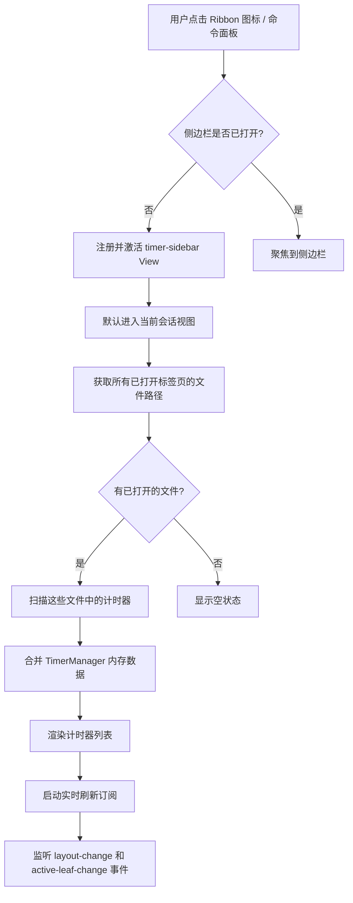
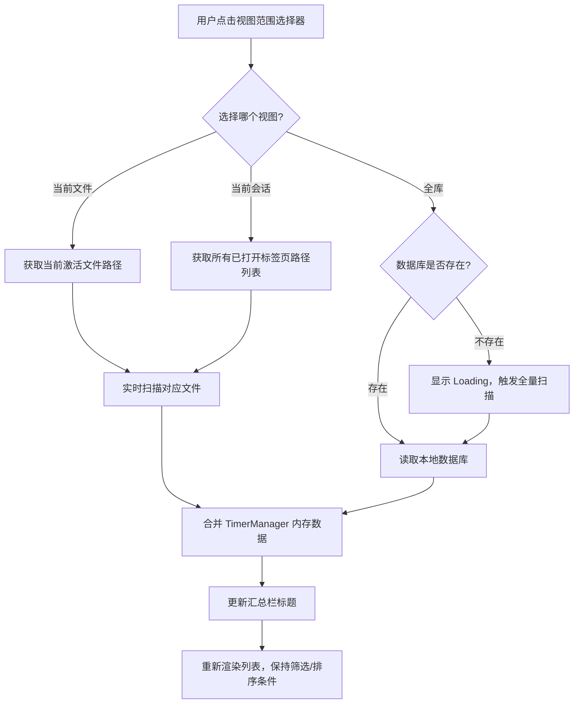
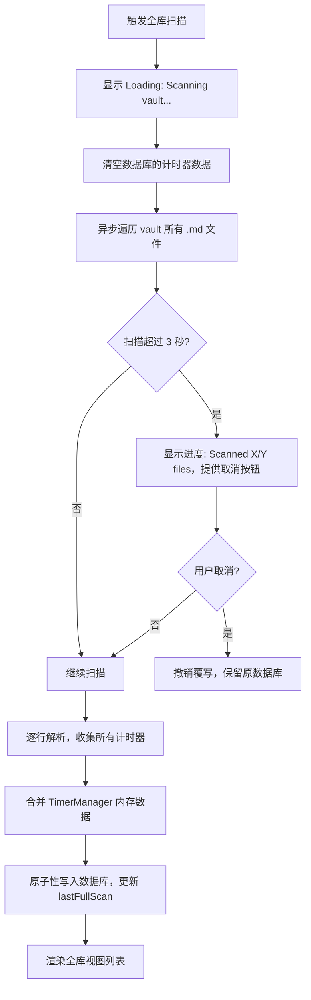
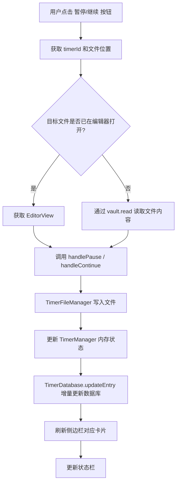

# 📋 PRD: Timer Sidebar

**文档版本**: v3.0
**创建日期**: 2026-02-25
**最后更新**: 2026-02-25
**状态**: 草稿
**优先级**: P1

---

## 一、背景与目标

### 1.1 需求来源

来自两条用户 Feature Request（FR）：

> **FR-1（统计汇总）**：用户每天有十几个任务，希望能将所有已记录的计时时长汇总，并以弹窗展示或复制到剪贴板。
>
> **FR-2（侧边栏总览）**：希望有一个侧边栏视图，能一览所有计时器（支持按状态/时长排序过滤），无需打开具体文件即可查看，并能直接在侧边栏中切换计时器状态，同时在底部状态栏显示计时时长。

### 1.2 核心痛点

| 痛点     | 描述                                                    |
| -------- | ------------------------------------------------------- |
| 分散性   | 计时器分布在多个笔记文件中，无法全局感知                |
| 低效性   | 查看某个计时器必须打开对应文件，操作路径长              |
| 缺乏汇总 | 无法快速获取今日/本周总计时时长                         |
| 操作割裂 | 开始/暂停计时器必须在编辑器内操作，无法在侧边栏直接控制 |
| 历史噪音 | 全库扫描会将历史已完成计时器混入当前视图，汇总数字失真  |

### 1.3 目标

1. **聚焦当前**：默认展示当前工作会话（已打开文件）中的计时器，消除历史噪音
2. **全局感知**：支持切换到全库视图，满足盘点场景
3. **快速操作**：支持在侧边栏直接控制计时器（开始/暂停/继续）
4. **数据汇总**：提供时长统计
5. **状态栏集成**：在 Obsidian 底部状态栏显示运行中计时器信息

### 1.4 展示范围设计决策

> **核心原则**：用户的"工作上下文"天然由**当前打开的文件**定义。侧边栏应该是当前工作会话的镜像，而不是整个知识库的档案馆。

侧边栏提供**三档展示范围**，用户可随时切换：

| 档位 | 名称                       | 数据来源                             | 汇总含义               | 适用场景       |
| ---- | -------------------------- | ------------------------------------ | ---------------------- | -------------- |
| ①   | **当前文件**         | 仅当前激活的编辑器文件               | 本文件所有计时器总时长 | 专注单任务文件 |
| ②   | **当前会话**（默认） | 所有已在 Obsidian 中打开的标签页文件 | 本次工作会话总时长     | 日常多任务管理 |
| ③   | **全库**             | 本地计时器数据库（离线索引）         | 历史所有计时器累计时长 | 盘点/归档场景  |

---

## 二、用户故事

| ID    | 角色     | 故事                                           | 验收标准                                         |
| ----- | -------- | ---------------------------------------------- | ------------------------------------------------ |
| US-01 | 日常用户 | 我希望打开侧边栏就能看到今天所有任务的计时状态 | 侧边栏默认展示当前会话文件中的计时器，无历史噪音 |
| US-02 | 日常用户 | 我希望不打开文件就能暂停/继续某个计时器        | 侧边栏每行有操作按钮，点击即可切换状态           |
| US-03 | 日常用户 | 我希望知道今天总共花了多少时间                 | 侧边栏底部显示当前会话汇总时长，支持一键复制     |
| US-04 | 日常用户 | 我希望快速找到正在运行的计时器                 | 支持按状态筛选，运行中的计时器置顶或高亮         |
| US-05 | 日常用户 | 我希望在不打开侧边栏时也能感知当前运行状态     | 状态栏显示运行中计时器数量和总时长               |
| US-06 | 日常用户 | 我希望点击侧边栏中的计时器能跳转到对应笔记     | 点击计时器条目，跳转并高亮对应行                 |
| US-07 | 高级用户 | 我希望能查看整个知识库的计时器全貌             | 切换到全库视图，从本地数据库加载，无需实时扫描   |
| US-08 | 高级用户 | 我希望计时器能关联到所属项目                   | 计时器支持携带 project 标签，侧边栏展示项目归属  |

---

## 三、功能范围

### 3.1 In Scope（本期）

- ✅ Timer Sidebar 视图（Obsidian Leaf View）
- ✅ **三档视图模式**：当前文件 / 当前会话（默认）/ 全库，支持一键切换
- ✅ 计时器列表展示（文件名、行内容摘要、状态、时长、项目标签）
- ✅ 列表排序（按状态、时长、文件名、最近更新）
- ✅ 状态筛选（运行中 / 已暂停 / 全部）
- ✅ 侧边栏内直接操作（暂停 / 继续）
- ✅ 点击跳转到对应文件和行
- ✅ 汇总统计（总时长、运行中数量），汇总标题随视图模式变化
- ✅ 底部状态栏集成（显示运行中计时器数量 + 总时长）
- ✅ 实时刷新（与 TimerManager 的 tick 同步）
- ✅ **本地计时器数据库**：全库视图使用离线索引，避免实时全量扫描
- ✅ **计时器底层数据扩展**：新增 `project` 可选字段
- ✅ **文件组（File Groups）管理**：支持自定义命名（默认 FileGroup1/2/3），在设置页通过弹窗管理
- ✅ **文件组正则支持**：每条 pattern 独立正则开关（`.*` 开关），关闭时为路径前缀匹配
- ✅ **文件组路径匹配规则**：无显式后缀的 pattern 自动视为文件夹（追加 `/`）
- ✅ **全局视图文件组筛选**：全库视图中选择文件组后，计时器列表和总计时同步过滤
- ✅ **文件组设置即时生效**：设置页修改文件组后立即在侧边栏全局视图中生效
- ✅ **侧边栏统计增强**：新增计时器个数统计（总数 / 运行中 / 暂停），新增运行中总时长和暂停总时长分项展示
- ✅ **状态栏独立设置区域**：是否显示状态栏、展示最长运行时长还是总时长
- ✅ **Timer by Checkbox 路径控制改为文件组模式**：支持多个文件组，满足任意一个组即可启用功能，组内黑名单优先于白名单；旧版数据自动迁移
- ✅ **i18n 全覆盖**：Status Bar、Timer Sidebar、File Groups、Checkbox Path Control 等所有新增 UI 文字均支持 en / zh / zhTW / ja / ko 五语言

### 3.2 Out of Scope（本期不做）

- ❌ 侧边栏内直接新建计时器（需在编辑器内操作）
- ❌ 侧边栏内删除计时器
- ❌ 跨文件批量操作（批量暂停所有）—— 可作为 v2 功能
- ❌ 历史数据图表（时间轴、日历热力图）
- ❌ 导出为 CSV/JSON
- ❌ project 标签的创建、编辑、管理交互（仅读取展示）
- ❌ 复制统计摘要到剪贴板

---

## 四、计时器底层数据结构扩展

> 仅新增 `project` 可选字段。计时器本身已有最近更新时间戳，无需额外添加。

### 4.1 现有格式

```
timer-r: 01:05:32
timer-p: 00:45:00
```

计时器本身已记录最近一次状态变更的时间戳（由现有 TimerDataUpdater 维护），侧边栏直接读取该字段用于排序和展示，无需新增 `updated` 字段。

### 4.2 扩展后格式

在现有格式基础上，新增 `project` **可选属性**

**字段说明**：

| 字段        | 格式                            | 必填 | 说明                                       |
| ----------- | ------------------------------- | ---- | ------------------------------------------ |
| `project` | 字符串，支持 `/` 分隔多个标签 | 否   | 计时器所属项目标签，由用户在笔记中手动标注 |

**兼容性原则**：

- `project` 字段为**可选**，旧格式计时器无需迁移，解析时缺省值为 `null`
- 解析器需向后兼容，遇到无 project 字段的旧格式正常解析
- `project` 字段由用户手动维护，程序不自动写入

### 4.3 project 字段的使用场景

1. **卡片展示**：计时器卡片中显示项目归属标签（`🏷 project-alpha`）
2. **全库视图分组**：全库视图中可按 project 字段对计时器进行分组展示
3. **复制汇总分组**：复制文本中可按项目汇总时长（未来扩展）

### 4.4 TimerParser 扩展

```javascript
// 扩展解析结果，新增可选字段
interface ParsedTimerData {
  ... // 参照已有结构
  ,project: string | null;  // 新增：项目标签，可选
}
```

---

## 五、本地计时器数据库

> 全库视图的核心基础设施，避免每次打开全库视图都实时扫描整个 vault。

### 5.1 设计原则

- **离线索引**：数据库存储在本地（Obsidian plugin data），不依赖实时扫描
- **按需更新**：仅在以下情况重建数据库，平时直接读取缓存
- **增量同步**：计时器**状态变更**（暂停/继续/新建）时同步到数据库；**运行中计时器的秒数递增不写入数据库**，仅在内存中维护
- **存储格式由开发和数仓专家决定**：本文档不限定具体存储格式（JSON / SQLite / 其他），仅定义数据模型和接口契约

### 5.2 数据模型

数据库需持久化以下字段（具体存储格式由实现层决定）：

| 字段             | 类型          | 说明                                                                    |
| ---------------- | ------------- | ----------------------------------------------------------------------- |
| `id`           | string        | 计时器唯一标识，格式为 `filePath::lineNum`                            |
| `filePath`     | string        | 相对于 vault 根目录的文件路径                                           |
| `lineNum`      | number        | 计时器所在行号（0-indexed）                                             |
| `state`        | enum          | `timer-r`（运行中）/ `timer-p`（已暂停）                            |
| `duration`     | string        | 时长快照 `HH:MM:SS`（**仅在状态变更时更新，不随秒数递增写入**） |
| `timestamp`    | string        | 计时器本身记录的最近状态变更时间戳（现有字段）                          |
| `project`      | string\| null | 项目标签，可为 null                                                     |
| `lineText`     | string        | 计时器所在行的原始文本（用于摘要展示）                                  |
| `lastFullScan` | string        | 最近一次全量扫描的时间（元数据，展示在全库视图标题区域）                |

### 5.3 数据库更新策略

| 触发条件                              | 操作                                | 说明                       |
| ------------------------------------- | ----------------------------------- | -------------------------- |
| 本地数据库不存在                      | 全量扫描，重建数据库                | 首次安装或数据库被删除     |
| 用户手动点击                          | 用户手动点击"全库扫描"按钮          | 清空数据库，全量扫描重写   |
| 用户在编辑器中操作计时器（暂停/继续） | 增量更新对应条目                    | 实时同步，保持数据库最新   |
| 侧边栏操作计时器（暂停/继续）         | 增量更新对应条目                    | 实时同步                   |
| 文件被删除                            | 从数据库中移除该文件的所有条目      | 监听 vault `delete` 事件 |
| 文件被重命名                          | 更新数据库中对应条目的 `filePath` | 监听 vault `rename` 事件 |
| 文件变更路径                          | 更新数据库中对应条目的 `filePath` | 待补充                     |

> ⚠️ **不触发全量扫描的情况**：用户在编辑器中手动修改了计时器文本（不通过插件操作）。这种情况下数据库可能短暂不一致，用户可手动触发全库扫描来修复。

### 5.4 全量扫描流程

```
用户触发全库扫描（或首次初始化）
  → 暂停所有运行中计时器，显示关闭计时器提示
  → 显示 Loading 状态（"Scanning vault..."）
  → 异步遍历 vault 中所有 .md 文件
      → 逐行解析，收集 timer-r / timer-p
      → 合并 TimerManager 内存数据（运行中的以内存为准）
  → 原子性覆写数据库（具体实现由开发决定，需保证覆写原子性）
  → 渲染全库视图列表
```

**性能保护**：

- 扫描超过 3 秒显示进度提示（"Scanned X / Y files"），允许取消
- 取消后撤销覆写，保障覆写行为原子性
- 可复用现有 `checkboxToTimerPathRestriction` 路径限制设置，缩小扫描范围

---

## 六、功能详细设计

### 6.1 Timer Sidebar 视图

#### 6.1.1 视图注册

- 通过 `this.registerView('timer-sidebar', ...)` 注册为 Obsidian ItemView
- View Type ID：`timer-sidebar`
- 默认位置：右侧面板（`right`）
- 通过 Ribbon 图标（`⏱`）或命令面板打开

#### 6.1.2 整体布局

```
┌─────────────────────────────────────────────┐
│  ⏱ Timer Sidebar                  [刷新] [⋯] │  ← 标题栏
├─────────────────────────────────────────────┤
│  [当前会话 ▼]  筛选:[全部 ▼]  排序:[状态 ▼]   │  ← 工具栏（含视图切换）
├─────────────────────────────────────────────┤
│  📊 今日会话: 2运行中  总计: 01:23:45  [复制] │  ← 汇总栏（标题随视图变化）
├─────────────────────────────────────────────┤
│                                             │
│  ┌───────────────────────────────────────┐  │
│  │ ⏳ 01:05:32  [暂停]                   │  │  ← 运行中计时器
│  │ 📄 daily-note.md · 第12行             │  │
│  │ ✅ 完成产品文档初稿                    │  │
│  └───────────────────────────────────────┘  │
│                                             │
│  ┌───────────────────────────────────────┐  │
│  │ 💐 00:45:00  [继续]                   │  │  ← 已暂停计时器
│  │ 📄 project-alpha.md · 第8行           │  │
│  │ ✅ 需求评审会议                        │  │
│  │ 🏷 project-alpha                      │  │  ← 有 project 字段时显示标签
│  └───────────────────────────────────────┘  │
│                                             │
└─────────────────────────────────────────────┘
```

---

### 6.2 三档视图设计

#### 6.2.1 视图切换入口

工具栏左侧放置**视图范围选择器**（下拉菜单），三个选项：

```
[当前文件]
[当前会话] ← 默认选中，带 • 标记
[全库]
```

切换时：

1. 立即更新汇总栏标题
2. 重新加载对应范围的计时器数据
3. 保持当前的筛选和排序条件不变

#### 6.2.2 视图一：当前文件视图

**数据来源**：

```
监听 app.workspace.on('active-leaf-change') 事件
  → 获取当前激活 leaf 对应的文件路径
  → 实时扫描该文件中的计时器
  → 合并 TimerManager 内存数据
```

**展示内容**：

- 仅展示当前激活编辑器文件中的计时器
- 运行中计时器实时更新时长（每秒）

**动态响应**：

- 用户切换到另一个标签页 → 监听 `active-leaf-change` 事件，自动切换到新激活文件的计时器列表
- 用户切换到非 markdown 文件（如设置页）→ 保持展示上一个 markdown 文件的计时器，如无上一个markdown文件则展示空

**汇总栏标题**：`📊 本文件`

**空状态处理**：

- 当前无激活文件 → `"Open a note to see its timers here."`
- 当前文件中无计时器 → `"No timers in this note. Start one in the editor!"`

#### 6.2.3 视图二：当前会话视图（默认）

**数据来源**：

```
获取 app.workspace.getLeavesOfType('markdown') 中所有已打开的文件路径
  → 仅扫描这些文件中的计时器
  → 合并 TimerManager 内存数据（运行中的以内存为准）
```

**展示内容**：

- 所有当前已打开标签页文件中的 `timer-r` 和 `timer-p` 计时器
- 按文件分组展示（文件名作为分组标题）
- 运行中计时器实时更新时长（每秒）

**动态响应**：

- 用户在 Obsidian 中打开新标签页 → 监听 `layout-change` 事件，自动扫描新文件，追加其计时器到列表
- 用户关闭标签页 → 对应文件的计时器从列表中移除（运行中的计时器不受影响，继续运行）

**汇总栏标题**：`📊 今日会话`

**空状态处理**：

- 当前无打开文件 → `"Open some notes to see their timers here."`
- 打开的文件中无计时器 → `"No timers in your open notes. Start one in the editor!"`

#### 6.2.4 视图三：全库视图

**数据来源**：

```
读取本地计时器数据库
  → 若数据库不存在 → 触发全量扫描，重建数据库
  → 若数据库存在 → 直接加载，合并 TimerManager 内存数据（运行中的以内存为准）
  → 按当前选中的文件组筛选
  → 渲染列表
```

**展示内容**：

- 数据库中符合当前文件组范围的计时器快照
- 支持按 `project` 字段分组（若有）
- 标题区域显示数据库最近全量扫描时间（`上次全库扫描: 2026-02-25 13:30`）
- 提供"重新全库扫描"按钮，手动触发全量重建

**汇总栏标题**：`📊 全库汇总`

**空状态处理**：

- 数据库为空且扫描中 → 显示 Loading（`"Scanning vault..."`）
- 全库无计时器 → `"No timers found in your vault. Start a timer in any note!"`

#### 6.2.5 三视图对比

| 功能                | 当前文件               | 当前会话               | 全库                   |
| ------------------- | ---------------------- | ---------------------- | ---------------------- |
| 计时器列表          | ✅                     | ✅                     | ✅                     |
| 实时时长更新        | ✅（运行中，内存维护） | ✅（运行中，内存维护） | ✅（运行中，内存维护） |
| 暂停/继续操作       | ✅                     | ✅                     | ✅                     |
| 点击跳转            | ✅                     | ✅                     | ✅                     |
| 状态筛选/排序       | ✅                     | ✅                     | ✅                     |
| 文件组筛选器        | —                     | —                     | ✅                     |
| 激活标签页切换响应  | ✅ 自动                | —                     | —                     |
| 打开/关闭标签页响应 | —                     | ✅ 自动                | —                     |
| 项目标签展示        | ✅ 支持分组            | ✅ 支持分组            | ✅ 支持分组            |
| 数据来源            | 实时扫描当前文件       | 实时扫描已打开文件     | 本地数据库             |
| 全库扫描 Loading    | —                     | —                     | 仅首次/手动触发        |
| 汇总语义            | 本文件投入             | 今日工作总时长         | 历史累计（参考用）     |

---

### 6.3 计时器卡片设计

每个计时器以卡片形式展示，包含以下信息：

| 元素       | 内容                                              | 说明                             |
| ---------- | ------------------------------------------------- | -------------------------------- |
| 状态图标   | 默认为⏳（运行中）/ 💐（已暂停）                  | 与编辑器内图标一致，按照设置展示 |
| 时长显示   | `HH:MM:SS`                                      | 运行中实时更新（每秒）           |
| 操作按钮   | `[暂停]` / `[继续]`                           | 点击触发对应操作                 |
| 文件来源   | `📄 文件名 · 第N行`                            | 点击跳转到对应位置               |
| 行内容摘要 | 去除 Markdown 语法后的纯文本（li/ul/checkbox 等） | 最多显示 40 字符，超出省略       |
| 项目标签   | `🏷 project-name`（可选）                       | 仅当 project 字段存在时显示      |

**卡片状态样式**：

- 支持卡片格式/文本格式，支持颜色自定义，支持icon自定义（已有功能）

---

### 6.4 工具栏交互

**视图范围选择器**（最左侧）：

```
[当前文件]
[当前会话] ← 默认
[全库]
```

**状态筛选下拉（Filter）**：

```
[全部]
[运行中]
[已暂停]
```

**排序下拉（Sort）**：

```
[按状态]      → 运行中优先
[按时长↓]     → 时长从长到短
[按时长↑]     → 时长从短到长
[按文件名↓]    → 字母顺序降序
[按文件名↑]    → 字母顺序升序
[按更新时间]  → 最近更新优先（利用计时器现有时间戳字段）
```

---

### 6.5 汇总栏

汇总栏标题和语义随视图模式动态变化：

| 视图模式 | 汇总栏标题      | 汇总含义                       |
| -------- | --------------- | ------------------------------ |
| 当前文件 | `📊 本文件`   | 当前文件所有计时器总时长       |
| 当前会话 | `📊 当前会话` | 当前所有打开文件的计时器总时长 |
| 全库     | `📊 全库汇总` | 数据库中所有计时器累计时长     |

```
📊 当前会话: 2运行中  总计: 01:23:45
```

---

### 6.6 状态栏集成

在 Obsidian 底部状态栏右侧添加状态栏元素：

```
⏳ 2 running · 01:23:45
```

- 无运行中计时器时：隐藏或显示 `⏱ No timers running`
- 点击状态栏元素：打开 Timer Sidebar（并切换到当前会话视图）
- 更新频率：与 `TimerManager` 的 tick 同步（每秒），仅在有运行中计时器时更新

---

### 6.7 侧边栏操作

#### 6.7.1 暂停操作

```
用户点击 [暂停]
  → 调用 TimerPlugin.handlePause(view, lineNum, parsedData)
  → TimerManager 停止对应 interval
  → TimerFileManager 写入文件（timer-p 状态）
  → TimerDatabase.updateEntry(id, newData)  ← 增量更新数据库
  → Sidebar 刷新该卡片状态
```

#### 6.7.2 继续操作

```
用户点击 [继续]
  → 调用 TimerPlugin.handleContinue(view, lineNum, parsedData)
  → TimerManager 重新启动 interval
  → TimerFileManager 写入文件（timer-r 状态）
  → TimerDatabase.updateEntry(id, newData)  ← 增量更新数据库
  → Sidebar 刷新该卡片状态
```

> ⚠️ **关键约束**：侧边栏操作需要获取对应文件的 `view` 和 `lineNum`。
>
> - 若文件已在编辑器中打开：直接获取 EditorView
> - 若文件未打开：通过 `vault.read` + `vault.modify` 的文件模式操作（与预览模式逻辑一致）

#### 6.7.3 跳转操作

```
用户点击文件来源区域
  → app.workspace.openLinkText(filePath)
  → 滚动到对应行（editor.scrollIntoView）
  → 光标定位到该行
```

⚠️ 边际情况：如果指定路径无法找到计时器则提示跳转失败

---

## 七、交互流程图

### 7.1 打开侧边栏



### 7.2 视图切换



### 7.3 全库扫描



### 7.4 侧边栏操作计时器



---

## 八、设置项扩展

在现有设置面板中新增 **Timer Sidebar** 分组，包含两个子区域：**通用设置** 和 **文件组管理**。

### 8.1 通用设置

| 设置项                        | 类型   | 默认值        | 说明                                                                                                   |
| ----------------------------- | ------ | ------------- | ------------------------------------------------------------------------------------------------------ |
| `showStatusBar`             | Toggle | `true`      | 是否在底部状态栏显示计时信息                                                                           |
| `statusBarMode`             | Select | `max`       | 状态栏展示模式：`max`（最长运行计时器时长）/ `total`（所有运行中计时器总时长）                   |
| `sidebarDefaultScope`       | Select | `open-tabs` | 默认展示范围：`active-file` / `open-tabs` / `all`                                                |
| `sidebarDefaultFilter`      | Select | `all`       | 默认筛选：`all` / `running` / `paused`                                                           |
| `sidebarDefaultSort`        | Select | `status`    | 默认排序：`status` / `dur-desc` / `dur-asc` / `filename-desc` / `filename-asc` / `updated` |
| `autoRefreshSidebar`        | Toggle | `true`      | 是否自动实时刷新侧边栏                                                                                 |
| `globalScanPathRestriction` | Toggle | `false`     | 全库扫描时是否复用路径限制设置                                                                         |

### 8.2 文件组管理

> 文件组筛选器仅在**全库视图**中生效，用于将全库计时器按路径范围分组展示，方便聚焦特定项目或文件夹。

#### 8.2.1 文件组数据结构

```typescript
interface TimerFileGroup {
  id: string;          // 唯一标识（自动生成）
  name: string;        // 组名称，默认为 FileGroup1/2/3...，支持自定义
  whitelist: string[]; // 路径白名单，支持路径前缀匹配和正则表达式
  blacklist: string[]; // 路径黑名单，优先级高于白名单
}
```

**Pattern 存储格式**：

- 普通文本：直接存储字符串，如 `Projects/Work/`
- 正则表达式：以 `/pattern/flags` 格式存储，如 `/日记\//`

**路径匹配规则**：

- **正则模式**（pattern 以 `/` 包裹）：使用 `RegExp` 对文件路径进行测试
- **普通文本模式**：
  - 若 pattern 末尾已有 `/`：直接作为路径前缀匹配
  - 若 pattern 末尾无 `/` 且最后一段**包含 `.`**（有显式后缀）：精确前缀匹配（视为文件名）
  - 若 pattern 末尾无 `/` 且最后一段**不含 `.`**：自动追加 `/`，视为文件夹前缀匹配
- 黑名单优先级高于白名单：若文件同时命中白名单和黑名单，则**不展示**
- 白名单为空时，视为匹配所有路径（仅黑名单生效）

**UI 交互**：

- 每条 pattern 独立显示为一行：`[文本输入框] [.* 正则开关] [✕ 删除按钮]`
- `.*` 开关控制该条是否启用正则模式，开启时高亮显示
- 组名称以粗体独立一行展示，下方为可编辑输入框

#### 8.2.2 设置页 UI 交互

```
┌─────────────────────────────────────────────────────┐
│  Timer Sidebar > 文件组管理                           │
├─────────────────────────────────────────────────────┤
│  [+ 新增文件组]                                       │
│                                                     │
│  ┌─────────────────────────────────────────────┐   │
│  │ 📁 工作项目                          [编辑] [删除] │   │
│  │ 白名单: Projects/, Work/              │   │
│  │ 黑名单: Projects/Archive/             │   │
│  └─────────────────────────────────────────────┘   │
│                                                     │
│  ┌─────────────────────────────────────────────┐   │
│  │ 📁 日记                              [编辑] [删除] │   │
│  │ 白名单: Daily/, Journal/              │   │
│  │ 黑名单: （无）                         │   │
│  └─────────────────────────────────────────────┘   │
└─────────────────────────────────────────────────────┘
```

**新增/编辑文件组弹窗**：

```
┌──────────────────────────────────────┐
│  编辑文件组                            │
├──────────────────────────────────────┤
│  名称:  [工作项目              ]       │
│                                      │
│  路径白名单（每行一个路径前缀）:         │
│  ┌──────────────────────────────┐    │
│  │ Projects/                    │    │
│  │ Work/                        │    │
│  └──────────────────────────────┘    │
│                                      │
│  路径黑名单（每行一个路径前缀）:         │
│  ┌──────────────────────────────┐    │
│  │ Projects/Archive/            │    │
│  └──────────────────────────────┘    │
│                                      │
│              [取消]  [保存]           │
└──────────────────────────────────────┘
```

**操作说明**：

- **新增**：点击

---

### 8.3 Timer by Checkbox 路径控制（文件组模式）

> 原有的 `disable / whitelist / blacklist` 三选一模式已升级为文件组模式，与 Timer Sidebar 的 File Groups 使用相同的数据结构和 UI 交互。

**启用逻辑**：文件路径满足**任意一个**文件组的规则即可启用 Checkbox 功能（组内黑名单优先于白名单）。

**旧版数据迁移**：检测到旧版 `checkboxToTimerPathRestriction` 字段不为 `disable` 且有路径时，自动迁移为一个名为 `Migrated` 的文件组，旧路径字符串默认视为正则（用 `/pattern/` 包裹）。迁移后清空旧字段，不重复迁移。

**设置项**：

| 设置项                  | 类型   | 默认值 | 说明                                                                 |
| ----------------------- | ------ | ------ | -------------------------------------------------------------------- |
| `checkboxPathGroups`  | Array  | `[]` | 文件组列表，结构与 `timerFileGroups` 相同                          |

**空组行为**：若 `checkboxPathGroups` 为空，则对所有文件生效（无路径限制）。

---

### 8.4 侧边栏统计区域

侧边栏顶部统计区域分为两行，用分割线隔开：

**第一行：计时器个数统计**

```
计时器   N  ▶运行中  ⏸暂停
```

**第二行：时长统计**

```
时长统计   Total: HH:MM:SS   ▶ HH:MM:SS   ⏸ HH:MM:SS
```

- 两行均随文件组筛选同步过滤
- 运行中时长每秒实时更新（patch DOM，不重建整行）
- 个数统计也随每秒 tick 同步更新

---

## 九、边界情况与异常处理

| 场景                               | 处理方式                                                                       |
| ---------------------------------- | ------------------------------------------------------------------------------ |
| 当前无激活文件（当前文件视图）     | 显示引导文案："Open a note to see its timers here."                            |
| 切换到非 markdown 文件（设置页等） | 保持展示上一个 markdown 文件的计时器                                           |
| 当前无打开文件（当前会话视图）     | 显示引导文案："Open some notes to see their timers here."                      |
| 打开的文件中无计时器               | 显示引导文案："No timers in your open notes. Start one in the editor!"         |
| 全库无计时器                       | 显示引导文案："No timers found in your vault."                                 |
| timer-db.json 不存在（全库视图）   | 自动触发全量扫描，显示 Loading                                                 |
| timer-db.json 格式损坏             | 清空并重新全量扫描，提示用户                                                   |
| 文件被删除但数据库中仍有记录       | 监听 vault `delete` 事件，自动从数据库移除；卡片标记 `⚠️ File not found` |
| 文件被重命名                       | 监听 vault `rename` 事件，自动更新数据库中的 filePath                        |
| 文件行号偏移（用户手动编辑了文件） | 触发 `findTimerGlobally` 重新定位，失败则标记 `⚠️ Position lost`         |
| 大型 vault 扫描超时（>3s）         | 显示进度提示，允许用户取消，取消后保留已扫描结果                               |
| 剪贴板 API 不可用（移动端限制）    | 降级为弹窗展示文本，用户手动复制                                               |
| 多个文件同时有运行中计时器         | 全部正常显示，状态栏汇总所有运行中数量                                         |
| 侧边栏关闭时有运行中计时器         | 计时器继续运行，不受影响（仅视图关闭）                                         |
| 旧格式计时器（无 project 字段）    | 正常解析，project 字段缺省为 null，不影响展示                                  |

---

## 十、技术实现要点

### 10.1 新增类

| 类名                     | 职责                                                                           |
| ------------------------ | ------------------------------------------------------------------------------ |
| `TimerSidebarView`     | 继承 `ItemView`，负责侧边栏 UI 渲染和交互                                    |
| `TimerScanner`         | 扫描文件（支持单文件、文件列表两种模式），供当前文件/当前会话视图使用          |
| `TimerDatabase`        | 管理本地计时器数据库，提供读取、增量更新、全量重建接口（存储格式由实现层决定） |
| `TimerSummary`         | 纯函数，计算汇总统计                                                           |
| `TimerFileGroupFilter` | 纯函数，根据文件组白/黑名单规则过滤计时器列表                                  |

### 10.2 TimerDatabase 接口

> 存储格式（JSON / SQLite / 其他）由开发和数仓专家决定，以下为接口契约。

```javascript
class TimerDatabase {
  // 读取数据库（全量）
  async load(): Promise<TimerDbData>

  // 增量更新单条记录（仅在状态变更时调用，不在秒数递增时调用）
  async updateEntry(id: string, data: Partial<TimerEntry>): Promise<void>

  // 从数据库中移除某文件的所有记录（文件删除时调用）
  async removeFile(filePath: string): Promise<void>

  // 更新某文件的路径（文件重命名时调用）
  async renameFile(oldPath: string, newPath: string): Promise<void>

  // 全量重建（原子性清空后重写）
  async rebuild(entries: TimerEntry[]): Promise<void>

  // 检查数据库是否存在
  async exists(): Promise<boolean>
}
```

### 10.3 TimerPlugin 扩展

```javascript
// 新增方法
openSidebar()              // 打开/激活侧边栏
refreshSidebar()           // 触发侧边栏刷新（由 onTick 调用）
initStatusBar()            // 初始化状态栏元素
updateStatusBar()          // 更新状态栏显示（由 onTick 调用）
onLeafOpen(leaf)           // 监听标签页打开，当前会话视图追加扫描
onLeafClose(leaf)          // 监听标签页关闭，当前会话视图移除对应计时器
onActiveLeafChange(leaf)   // 监听激活标签页切换，当前文件视图响应
onFileDelete(file)         // 监听文件删除，更新数据库
onFileRename(file, old)    // 监听文件重命名，更新数据库
```

### 10.4 与现有架构的集成点

```
TimerManager.onTick
  → TimerPlugin.onTick (已有)
  → TimerPlugin.refreshSidebar (新增)   ← 侧边栏实时更新
  → TimerPlugin.updateStatusBar (新增)  ← 状态栏实时更新

app.workspace.on('active-leaf-change')
  → TimerPlugin.onActiveLeafChange (新增) ← 当前文件视图响应

app.workspace.on('layout-change')
  → TimerPlugin.onLeafOpen (新增)       ← 当前会话视图追加
  → TimerPlugin.onLeafClose (新增)      ← 当前会话视图移除

app.vault.on('delete')
  → TimerPlugin.onFileDelete (新增)     ← 数据库清理

app.vault.on('rename')
  → TimerPlugin.onFileRename (新增)     ← 数据库路径更新

TimerPlugin.handlePause / handleContinue (已有，扩展)
  → TimerDatabase.updateEntry (新增)    ← 增量同步数据库
```

### 10.5 关键 API

```javascript
// 注册视图
this.registerView('timer-sidebar', (leaf) => new TimerSidebarView(leaf, this));

// 获取当前已打开的 markdown 文件列表
const openFiles = this.app.workspace
  .getLeavesOfType('markdown')
  .map(leaf => leaf.view.file?.path)
  .filter(Boolean);

// 获取当前激活文件
const activeFile = this.app.workspace.getActiveFile()?.path;

// 打开侧边栏
const leaf = this.app.workspace.getRightLeaf(false);
await leaf.setViewState({ type: 'timer-sidebar', active: true });

// 状态栏
this.statusBarItem = this.addStatusBarItem();
this.statusBarItem.setText('⏳ 2 running · 01:23:45');

// 复制到剪贴板（含降级处理）
try {
  await navigator.clipboard.writeText(summaryText);
} catch {
  new Modal(this.app).open(); // 降级弹窗
}
```

---

## 十一、UI 视觉规范

### 11.1 设计原则

1. **与 Obsidian 原生风格一致**：使用 CSS 变量（`--background-primary`、`--text-normal` 等），自动适配明暗主题
2. **信息密度适中**：卡片不过度拥挤，关键信息（时长、状态）突出显示
3. **操作反馈即时**：按钮点击有视觉反馈（loading 态），操作完成有状态变化动画
4. **视图切换无感**：切换视图时保持滚动位置，避免列表跳动

### 11.2 色彩语义

| 状态             | 颜色 | CSS 变量参考       |
| ---------------- | ---- | ------------------ |
| 运行中           | 绿色 | `--color-green`  |
| 已暂停           | 灰色 | `--text-muted`   |
| 警告（文件丢失） | 橙色 | `--color-orange` |
| 错误             | 红色 | `--color-red`    |
| 项目标签         | 蓝色 | `--color-blue`   |

### 11.3 响应式适配

- 侧边栏宽度 < 200px 时：隐藏文件来源行，仅显示时长和操作按钮
- 移动端：侧边栏以底部抽屉形式展示（Obsidian 移动端默认行为）

---

## 十二、验收标准

| 编号  | 验收项                     | 通过条件                                                           |
| ----- | -------------------------- | ------------------------------------------------------------------ |
| AC-01 | 侧边栏可正常打开           | 点击 Ribbon 图标或命令面板，侧边栏出现在右侧面板                   |
| AC-02 | 默认进入当前会话视图       | 侧边栏打开时，默认展示当前已打开文件中的计时器                     |
| AC-03 | 三档视图切换正常           | 切换当前文件/当前会话/全库，列表数据和汇总标题正确变化             |
| AC-04 | 当前文件视图响应激活切换   | 切换到不同标签页时，侧边栏自动展示新激活文件的计时器               |
| AC-05 | 当前会话视图响应标签页变化 | 打开/关闭标签页时，侧边栏列表自动更新                              |
| AC-06 | 全库视图读取本地数据库     | 切换到全库视图时，从 timer-db.json 加载，无需实时扫描              |
| AC-07 | 全库视图首次自动扫描       | 数据库不存在时，自动触发全量扫描并写入数据库                       |
| AC-08 | 手动全库扫描正常           | 点击"重新全库扫描"，清空并重建数据库，列表刷新                     |
| AC-09 | 运行中计时器实时更新       | 侧边栏中运行中计时器的时长每秒递增                                 |
| AC-10 | 筛选功能正常               | 切换筛选条件后，列表正确过滤                                       |
| AC-11 | 排序功能正常               | 切换排序条件后，列表顺序正确变化                                   |
| AC-12 | 暂停操作生效并同步数据库   | 点击暂停后，文件内容更新，数据库增量更新，侧边栏状态变为已暂停     |
| AC-13 | 继续操作生效并同步数据库   | 点击继续后，文件内容更新，数据库增量更新，侧边栏状态变为运行中     |
| AC-14 | 跳转功能正常               | 点击文件来源，正确打开文件并定位到对应行                           |
| AC-15 | 文件组筛选正常             | 全库视图中切换文件组，列表和汇总数据按白/黑名单规则正确过滤        |
| AC-16 | 状态栏正确显示             | 有运行中计时器时，状态栏显示数量和总时长                           |
| AC-17 | 文件删除自动清理数据库     | 删除含计时器的文件后，数据库中对应记录自动移除                     |
| AC-18 | 文件重命名自动更新数据库   | 重命名文件后，数据库中对应记录的 filePath 自动更新                 |
| AC-19 | 明暗主题适配               | 切换 Obsidian 主题后，侧边栏样式正确适配                           |
| AC-20 | 空状态处理                 | 各视图模式下的空状态文案正确显示                                   |
| AC-21 | 旧格式兼容                 | 无 project 字段的旧计时器正常解析和展示                            |
| AC-22 | project 字段展示           | 有 project 字段的计时器，卡片中显示项目标签                        |
| AC-23 | 文件组新增/编辑/删除       | 设置页中可正常新增、编辑、删除文件组，变更实时反映到全库视图筛选器 |
| AC-24 | 文件组路径匹配             | 白名单/黑名单路径前缀匹配正确，黑名单优先级高于白名单              |
| AC-25 | 运行中计时器秒数不写库     | 计时器运行时，数据库中 duration 字段不随秒数递增更新               |

---

## 十三、里程碑规划

| 阶段 | 内容                                                                                                | 目标                                   |
| ---- | --------------------------------------------------------------------------------------------------- | -------------------------------------- |
| M0   | **底层扩展**：TimerParser 支持 project 字段；TimerDatabase 类实现（读写、增量更新、全量重建） | 数据基础就绪，向后兼容                 |
| M1   | 基础侧边栏框架 + 当前会话视图 + 列表展示                                                            | 能看到当前工作文件的计时器             |
| M2   | 当前文件视图（含激活切换响应）+ 实时更新 + 筛选排序 + 跳转                                          | 三档视图中的两档可用，能高效浏览和导航 |
| M3   | 侧边栏操作（暂停/继续）+ 数据库增量同步 + 状态栏                                                    | 能直接控制计时器，数据库保持同步       |
| M4   | 全库视图 + 全量扫描 + 汇总统计 + 设置项（含文件组管理）                                             | 完整功能闭环                           |

---

*文档维护：如有功能变更，请同步更新本文档及 [architecture.md](./architecture.md)*

⚠️ **关键约束**：侧边栏操作需要获取对应文件的 `view` 和 `lineNum`。

- 若文件已在编辑器中打开：直接获取 EditorView
- 若文件未打开：通过 `vault.read` + `vault.modify` 的文件模式操作（与预览模式逻辑一致）

---

## 十四、埋点需求

> 本章节定义计时器运行时长的数据采集规范，用于支撑按 timer_id / project / 文件 / 自然日的多维时长聚合分析。具体底层存储实现（SQLite / JSON / 其他）由开发决定，本章节仅定义数据模型与上报契约。

### 14.1 数据表结构

#### 表一：`timers`（计时器元数据表）

记录每个计时器的基础信息快照，在计时器**状态发生变更**时更新。

| 字段 | 类型 | 必填 | 说明 |
| --- | --- | --- | --- |
| `timer_id` | string | ✅ | 计时器唯一标识（主键），格式为 `filePath::lineNum` |
| `file_path` | string | ✅ | 相对于 vault 根目录的文件路径 |
| `line_num` | number | ✅ | 计时器所在行号（0-indexed） |
| `line_text` | string | ✅ | 计时器所在行去除 Markdown 语法后的纯文本摘要 |
| `project` | string \| null | — | 项目标签，无则为 null |
| `state` | enum | ✅ | 计时器当前状态：`running` / `paused` / `deleted` / `lost` |
| `total_dur_sec` | number | ✅ | 计时器累计总时长（秒），与文件内 `data-dur` 同步；状态变更时更新，运行中秒数递增不写入 |
| `last_ts` | number | ✅ | 最近一次状态变更的 Unix 时间戳（秒） |
| `created_at` | number | ✅ | 计时器首次被记录的 Unix 时间戳（秒） |
| `updated_at` | number | ✅ | 本条记录最近一次更新的 Unix 时间戳（秒） |

**`state` 枚举说明**：

| 值 | 含义 | 触发时机 |
| --- | --- | --- |
| `running` | 运行中 | 用户点击开始/继续 |
| `paused` | 已暂停 | 用户点击暂停 |
| `deleted` | 已手动删除 | 用户在编辑器中删除了计时器所在行，或文件被删除 |
| `lost` | 位置丢失 | 文件行号偏移后无法重新定位计时器（`findTimerGlobally` 失败） |

> `deleted` 和 `lost` 状态的记录**不从表中物理删除**，保留用于历史时长统计。

---

#### 表二：`timer_sessions`（计时器运行区间表）

记录每次计时器的运行区间。每条记录代表**同一自然日内**的一段连续运行时长。

**跨天处理规则**：若一次运行跨越自然日边界（如 23:00 启动、次日 01:30 停止），则在**跨越零点时**自动拆分为两条记录，分别归属各自的自然日。

| 字段 | 类型 | 必填 | 说明 |
| --- | --- | --- | --- |
| `session_id` | number | ✅ | 自增主键 |
| `timer_id` | string | ✅ | 关联 `timers.timer_id` |
| `stat_date` | string | ✅ | 本条记录归属的自然日，格式 `YYYY-MM-DD`（用户本地时区） |
| `duration_sec` | number | ✅ | 本条记录的运行时长（秒）；跨天时仅包含归属日期内的时长 |
| `end_reason` | enum | ✅ | 本次运行结束原因（见下表） |
| `reported_at` | number | ✅ | 本条记录上报时的 Unix 时间戳（秒） |

**`end_reason` 枚举说明**：

| 值 | 含义 |
| --- | --- |
| `paused` | 用户主动暂停 |
| `deleted` | 计时器被删除（含文件删除） |
| `day_boundary` | 跨天自动拆分（零点切割，计时器仍在运行） |
| `plugin_unload` | 插件卸载/Obsidian 关闭时强制结束 |
| `crash_recovery` | 崩溃恢复时补报（上次未正常结束的 session） |

---

### 14.2 上报时机

#### 14.2.1 `timers` 表更新时机

| 触发事件 | 操作 | 备注 |
| --- | --- | --- |
| 计时器首次被扫描到（全量扫描或增量扫描） | INSERT（若不存在）或 UPDATE | 初始化元数据 |
| 用户点击开始/继续 | UPDATE `state=running`, `last_ts`, `updated_at` | — |
| 用户点击暂停（含侧边栏操作） | UPDATE `state=paused`, `total_dur_sec`, `last_ts`, `updated_at` | — |
| 文件被删除 | UPDATE `state=deleted`, `updated_at` | 监听 vault `delete` 事件 |
| 文件被重命名 | UPDATE `file_path`, `updated_at` | 监听 vault `rename` 事件 |
| 计时器位置丢失（`findTimerGlobally` 失败） | UPDATE `state=lost`, `updated_at` | — |
| 插件卸载 / 崩溃恢复 | UPDATE `state=paused`, `total_dur_sec`, `last_ts`, `updated_at` | 对所有 `state=running` 的记录执行 |

> ⚠️ **运行中秒数递增不触发 `timers` 表更新**，仅在状态变更时写入，与 5.1 节增量同步原则一致。

---

#### 14.2.2 `timer_sessions` 表上报时机

| 触发事件 | 上报内容 | `end_reason` | 备注 |
| --- | --- | --- | --- |
| 用户主动暂停 | 从上次开始运行到当前时刻的时长（仅当日部分） | `paused` | 若本次运行跨天，当日部分 = 当前时刻 − 今日零点 |
| 计时器被删除（含文件删除） | 从上次开始运行到删除时刻的时长（仅当日部分） | `deleted` | 同上 |
| 每日零点（计时器仍在运行） | 昨日零点到今日零点的时长（即整个昨日的运行时长） | `day_boundary` | 跨天拆分触发点；上报后计时器继续运行，今日重新开始计算 |
| 插件卸载 / Obsidian 关闭 | 从上次开始运行到卸载时刻的时长（仅当日部分） | `plugin_unload` | 对所有 `state=running` 的计时器执行 |
| 崩溃恢复（插件重新加载时检测到异常） | 从上次已知开始时间到 `last_ts` 的时长（仅当日部分） | `crash_recovery` | 以 `timers.last_ts` 作为结束时间补报 |

**跨天时长拆分示意**：

```
计时器在 Day1 23:00 开始运行，在 Day2 01:30 暂停

上报记录：
  ┌─ session 1: stat_date=Day1, duration_sec=3600, end_reason=day_boundary
  │  （Day1 23:00 → Day2 00:00，在零点自动触发）
  │
  └─ session 2: stat_date=Day2, duration_sec=5400, end_reason=paused
     （Day2 00:00 → Day2 01:30，在用户暂停时触发）
```

---

### 14.3 典型聚合查询示例

> 以下查询基于上述两张表，展示埋点数据的分析价值，供开发实现时参考验证。

**① 某自然日各计时器运行时长排行**

```sql
SELECT s.timer_id, t.file_path, t.project,
       SUM(s.duration_sec) AS total_sec
FROM timer_sessions s
JOIN timers t ON s.timer_id = t.timer_id
WHERE s.stat_date = '2026-02-25'
GROUP BY s.timer_id
ORDER BY total_sec DESC;
```

**② 某自然日按 project 汇总**

```sql
SELECT COALESCE(t.project, '(无标签)') AS project,
       SUM(s.duration_sec) AS total_sec
FROM timer_sessions s
JOIN timers t ON s.timer_id = t.timer_id
WHERE s.stat_date = '2026-02-25'
GROUP BY t.project
ORDER BY total_sec DESC;
```

**③ 某自然日按文件汇总**

```sql
SELECT t.file_path,
       SUM(s.duration_sec) AS total_sec,
       COUNT(DISTINCT s.timer_id) AS timer_count
FROM timer_sessions s
JOIN timers t ON s.timer_id = t.timer_id
WHERE s.stat_date = '2026-02-25'
GROUP BY t.file_path
ORDER BY total_sec DESC;
```

**④ 某计时器最近 7 天每日时长趋势**

```sql
SELECT stat_date, SUM(duration_sec) AS daily_sec
FROM timer_sessions
WHERE timer_id = 'notes/daily.md::12'
  AND stat_date >= date('now', '-6 days')
GROUP BY stat_date
ORDER BY stat_date;
```
