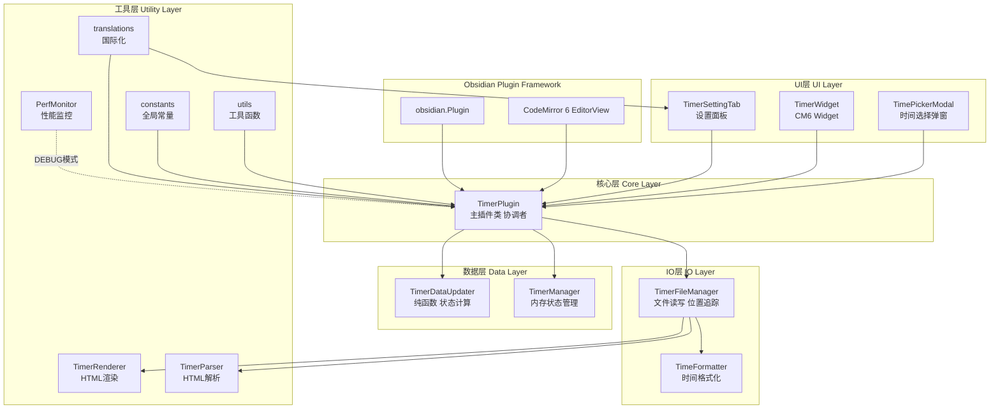
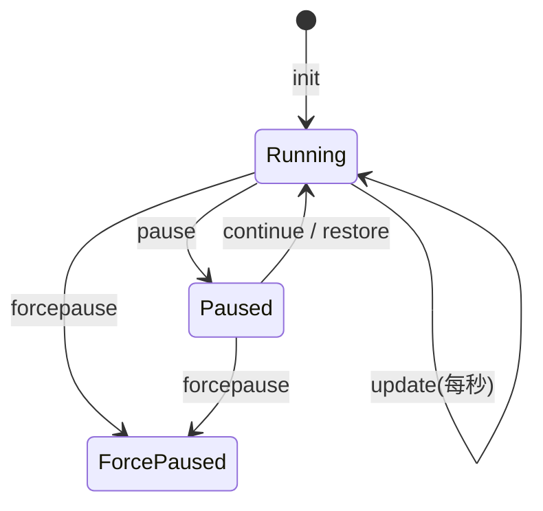
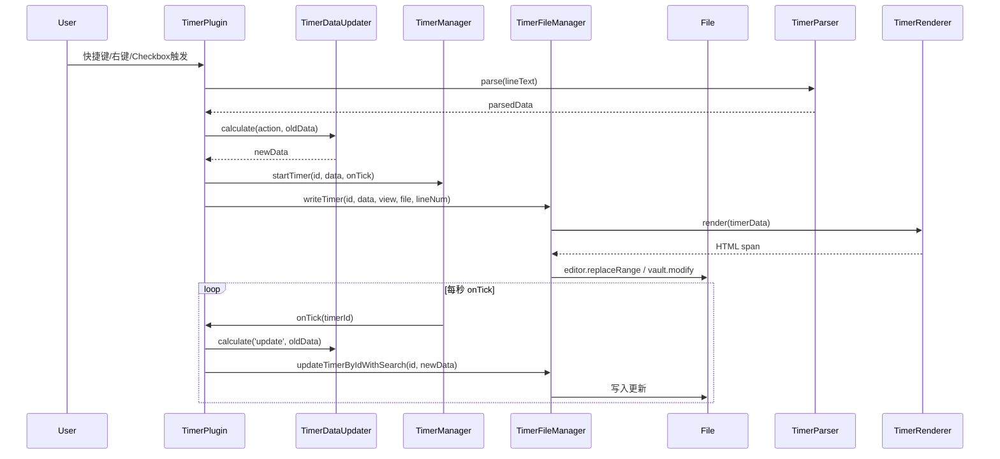

# 🏗️ Text Block Timer 插件架构分析

## 一、项目概览

| 属性 | 值 |
|------|-----|
| 插件名称 | Text Block Timer |
| 版本 | 1.0.9 |
| 作者 | frankthwang |
| 平台 | Obsidian（桌面 + 移动端） |
| 技术栈 | TypeScript 5、esbuild、CodeMirror 6、Obsidian API |
| 入口文件 | `src/main.ts`（多模块源码，构建产物为 `main.js`） |

---

## 二、项目目录结构

```
text-block-timer/
├── src/                        # TypeScript 源码目录
│   ├── main.ts                 # 插件入口，TimerPlugin 主类
│   ├── core/                   # 核心逻辑层
│   │   ├── TimerDataUpdater.ts # 纯函数状态机
│   │   ├── TimerManager.ts     # 内存计时器管理
│   │   ├── constants.ts        # 全局常量
│   │   └── utils.ts            # 通用工具函数
│   ├── io/                     # IO 层
│   │   ├── TimerFileManager.ts # 文件读写与位置管理
│   │   ├── TimerParser.ts      # HTML 解析器
│   │   ├── TimerRenderer.ts    # HTML 渲染器
│   │   └── TimeFormatter.ts    # 时间格式化工具
│   ├── ui/                     # UI 层
│   │   ├── TimerSettingTab.ts  # 设置面板
│   │   ├── TimerWidget.ts      # CodeMirror Widget
│   │   └── TimePickerModal.ts  # 时间选择弹窗
│   ├── i18n/
│   │   └── translations.ts     # 国际化翻译表
│   └── debug/
│       └── PerfMonitor.ts      # 性能监控（DEBUG 模式）
├── main.js                     # esbuild 构建产物（发布用）
├── styles.css                  # 插件样式
├── manifest.json               # Obsidian 插件清单
├── esbuild.config.mjs          # 构建配置
├── tsconfig.json               # TypeScript 编译配置
└── package.json                # 依赖与脚本
```

---

## 三、整体架构图



---

## 四、核心类职责分析

### 1. `TimerPlugin` — 主协调者（Orchestrator）
- 继承 `obsidian.Plugin`，是整个插件的**入口和协调中心**
- 负责注册命令（`toggle-timer`、`delete-timer`）、右键菜单、文件打开事件
- 监听 CodeMirror 6 的 `EditorView.updateListener`，实现 checkbox 状态变化触发计时器
- 监听 `pointerdown` DOM 事件，支持预览模式下的 checkbox 点击
- 核心操作方法：`handleStart` / `handlePause` / `handleContinue` / `handleDelete` / `handleRestore` / `handleForcePause`

### 2. `TimerManager` — 内存状态管理器
- 使用 `Map<timerId, {intervalId, data}>` 管理所有运行中的计时器
- 通过 `setInterval`（1秒）驱动 `onTick` 回调
- 实现**页面可见性监控**（`document.visibilitychange`），后台超过1秒时跳过 tick，防止性能问题
- 使用 `runningTicks: Set` 防止 tick 重叠执行（并发保护）
- 使用 `startedIds: Set` 记录本次会话启动过的计时器（用于 `quit` 模式判断）

### 3. `TimerDataUpdater` — 纯函数状态机
- **无副作用的纯函数类**，所有方法为 `static`
- 实现计时器状态机，支持 6 种 action：`init` / `continue` / `pause` / `update` / `restore` / `forcepause`
- 数据结构：`{ class: 'timer-r'|'timer-p', timerId, dur, ts }`



### 4. `TimerFileManager` — 文件IO与位置管理
- 使用 `Map<timerId, {view, file, lineNum}>` 缓存计时器位置
- 支持**编辑模式**（`editor.replaceRange`）和**预览模式**（`vault.read/modify`）两套写入路径
- `updateTimerByIdWithSearch`：先用缓存位置更新，失败则调用 `findTimerGlobally` 全文搜索
- `upgradeOldTimers`：兼容旧版 timer 格式，自动升级
- `calculateInsertPosition`：支持 `head`（行首，跳过 checkbox/列表/标题前缀）和 `tail`（行尾）两种插入位置

### 5. `TimerRenderer` — HTML 渲染器
- 纯静态工具类，将 timerData 渲染为 HTML `<span>` 标签
- 格式：`<span class="timer-r" id="{id}" data-dur="{dur}" data-ts="{ts}">【⏳HH:MM:SS 】</span>`
- 支持自定义运行/暂停图标（`runningIcon` / `pausedIcon`）

### 6. `TimerParser` — HTML 解析器
- 使用 `document.createElement('template')` + DOM 查询解析行内 HTML
- 支持**新格式**（v2：`timer-r/timer-p` class + `id` 属性）和**旧格式**（v1：`timer-btn` class + `timerId` 属性）的双版本兼容
- 返回标准化的 parsedResult，包含位置信息（`beforeIndex` / `afterIndex`）

### 7. `TimeFormatter` — 时间格式化工具
- 独立模块，负责将秒数格式化为 `HH:MM:SS` 等可读形式
- 与渲染器解耦，便于单独测试和复用

### 8. `TimerWidget` — CodeMirror 6 Widget
- 继承 CM6 `WidgetType`，在编辑器内嵌入计时器交互控件
- 负责计时器的内联渲染与点击事件处理

### 9. `TimePickerModal` — 时间选择弹窗
- 继承 `obsidian.Modal`，提供图形化的时间调整界面

### 10. `TimerSettingTab` — 设置面板
- 继承 `obsidian.PluginSettingTab`，动态渲染设置 UI
- 支持路径白名单/黑名单的动态增删输入框

---

## 五、数据流向



---

## 六、持久化策略

计时器数据**直接内嵌在 Markdown 文件的行内 HTML** 中，而非独立数据库：

```html
<span class="timer-r" id="LzHk3a" data-dur="3600" data-ts="1740456240">【⏳01:00:00 】</span>
```

- `data-dur`：累计秒数
- `data-ts`：最后一次时间戳（Unix 秒）
- `id`：Base62 压缩的时间戳 ID

这种设计的**优点**：零额外存储、随笔记迁移、天然版本控制；**缺点**：文件内容被 HTML 污染、跨文件查询困难。

---

## 七、国际化架构

- 静态 `TRANSLATIONS` 对象，支持 **5 种语言**：`en` / `zh` / `zhTW` / `ja` / `ko`
- 通过 `window.localStorage.getItem('language')` 读取 Obsidian 语言设置
- `getTranslation(key)` 函数实现 fallback 到英文

---

## 八、构建系统

| 工具 | 版本 | 用途 |
|------|------|------|
| TypeScript | ^5.7 | 类型检查、源码编译 |
| esbuild | ^0.24 | 打包构建，输出 `main.js` |
| `tsconfig.json` | — | 目标 ES2018，moduleResolution: bundler，types: [] |

**构建命令：**
```bash
npm run dev    # 开发模式（watch + inline sourcemap）
npm run build  # 生产模式（tree-shaking，无 sourcemap）
```

**esbuild 关键配置：**
- 入口：`src/main.ts` → 输出：`main.js`（CJS 格式，符合 Obsidian 要求）
- `external`：`obsidian`、`electron`、所有 `@codemirror/*` 包（由 Obsidian 运行时提供）
- `treeShaking: true`：自动移除未使用代码

---

## 九、架构优缺点评估

### ✅ 优点
1. **职责分离清晰**：Parser / Renderer / DataUpdater / Manager / FileManager 各司其职，独立模块
2. **TypeScript 类型安全**：全量 TS，编译期捕获类型错误，重构风险低
3. **纯函数设计**：`TimerDataUpdater` 无副作用，易于测试
4. **双模式兼容**：编辑模式和预览模式均有完整支持
5. **向后兼容**：v1/v2 格式自动升级
6. **性能优化**：后台可见性检测、tick 防重叠、背景节流
7. **标准化构建**：esbuild 极速打包，符合 Obsidian 官方插件模板规范

### ⚠️ 潜在问题
1. **位置缓存脆弱**：`fileManager.locations` 基于行号缓存，用户编辑文件后行号偏移会导致写入错位（虽有 `findTimerGlobally` 兜底，但性能开销大）
2. **HTML 内嵌 Markdown**：破坏 Markdown 纯文本性，与部分工具不兼容
3. **设置面板无防抖**：路径输入框每次 `input` 事件都触发 `saveSettings`

---

## 十、技术栈总结

```
TypeScript 5         ──── 类型安全、模块化源码
esbuild              ──── 极速打包，输出 CJS main.js
Obsidian Plugin API  ──── 插件生命周期、文件系统、工作区
CodeMirror 6         ──── 编辑器变更监听（EditorView.updateListener）、Widget
DOM API              ──── template 解析 HTML、visibilitychange 事件
Base62 编码          ──── 生成紧凑的计时器 ID
```
