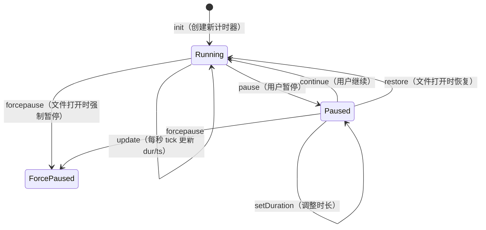

# 📋 PRD: Core Timer

**文档版本**: v1.0  |  **创建日期**: 2026-03-02  |  **状态**: 补充归档  |  **优先级**: P0

> 本文档为已上线功能的补充归档 PRD，描述 Text Block Timer 插件的核心计时器功能——即 Sidebar 和 Delete Enhancement 之外的所有功能。

---

## 一、背景与目标

### 1.1 需求来源

Obsidian 用户在日常笔记中记录任务、会议、学习等活动，需要一种**轻量级、零侵入**的方式来追踪各项活动的耗时。现有的计时工具要么是独立应用（需要在 Obsidian 外操作），要么使用独立数据库（数据与笔记割裂）。用户希望**计时数据直接嵌入笔记文本**，随笔记一同迁移、版本控制。

### 1.2 核心痛点

| 痛点 | 描述 |
|------|------|
| 工具割裂 | 计时工具与笔记工具分离，需频繁切换窗口 |
| 数据孤岛 | 计时数据存储在独立系统中，与笔记内容脱节 |
| 操作繁琐 | 每次计时需手动记录开始/结束时间再计算 |
| 缺乏持久化 | Obsidian 关闭或崩溃后计时数据丢失 |
| 格式不一 | 手动记录的时间格式不统一，难以汇总 |

### 1.3 目标

1. **零侵入计时**：计时器以 HTML span 形式内嵌 Markdown，不影响笔记的纯文本可读性
2. **多触发方式**：支持命令面板（快捷键）、右键菜单、Checkbox 状态联动三种触发方式
3. **实时显示**：运行中计时器每秒更新时长，编辑器内直观可见
4. **三层持久化**：Markdown HTML span ↔ JSON 数据库 ↔ IndexedDB，三层数据保持一致
5. **崩溃安全**：Obsidian 异常退出后，下次启动自动恢复/结算运行中计时器
6. **跨天支持**：运行中计时器跨越午夜时自动拆分日统计
7. **高度可配**：插入位置、时间格式、显示样式、颜色、图标等均可自定义
8. **国际化**：支持 en/zh/zhTW/ja/ko 五种语言
9. **向后兼容**：自动升级 v1 旧格式计时器至 v2 新格式

---

## 二、用户故事

| ID | 角色 | 故事 | 验收标准 |
|----|------|------|----------|
| US-01 | 日常用户 | 我希望在任意文本行上启动一个计时器 | 光标定位到目标行，按快捷键/右键菜单，计时器立即出现并开始计时 |
| US-02 | 日常用户 | 我希望暂停正在运行的计时器 | 在运行中的计时器行上按快捷键/右键菜单，计时器暂停，时长冻结 |
| US-03 | 日常用户 | 我希望恢复已暂停的计时器 | 在暂停的计时器行上按快捷键/右键菜单，计时器恢复运行 |
| US-04 | Tasks 用户 | 我希望通过切换 Checkbox 状态来控制计时器 | 将任务从 `[ ]` 改为 `[/]` 时自动启动计时，改为 `[x]` 时自动暂停 |
| US-05 | 日常用户 | 我希望调整已暂停计时器的时长 | 右键菜单选择"调整耗时"，弹出时间选择器，可自由设定时/分/秒 |
| US-06 | 日常用户 | 我希望 Obsidian 关闭后计时器不会丢失数据 | 根据 autoStopTimers 设置，重新打开后计时器要么恢复运行要么自动暂停 |
| US-07 | 日常用户 | 我希望计时器的外观可以自定义 | 设置面板中可修改运行/暂停图标、颜色、显示风格（徽章/纯文本）、时间格式 |
| US-08 | 日常用户 | 我希望 Obsidian 崩溃后不丢失计时数据 | 崩溃恢复机制自动结算之前运行中的计时器 |
| US-09 | 多语言用户 | 我希望插件界面显示我的语言 | 插件自动跟随 Obsidian 语言设置，支持中/英/繁中/日/韩 |
| US-10 | 日常用户 | 我希望在状态栏看到运行中计时器信息 | 底部状态栏显示运行中计时器数量和时长 |
| US-11 | 旧版用户 | 我希望升级后旧计时器自动兼容 | 打开包含 v1 格式计时器的文件时，自动升级为 v2 格式 |
| US-12 | 日常用户 | 我希望跨天工作时时长按天正确统计 | 计时器运行跨越午夜时，每日统计数据自动按天拆分 |

---

## 三、功能范围

### 3.1 In Scope（核心计时器功能）

- ✅ **计时器生命周期**：创建（init）→ 运行（running tick）→ 暂停（pause）→ 继续（continue）→ 运行
- ✅ **三种触发方式**：命令面板（toggle-timer）、右键编辑器菜单、Checkbox 状态联动
- ✅ **时间调整**：已暂停计时器可通过 TimePickerModal 手动设定时长
- ✅ **文件打开恢复**：根据 autoStopTimers 设置（never/quit/close）决定恢复策略
- ✅ **崩溃恢复**：启动时检测 JSON 数据库中 state=running 的记录，自动结算
- ✅ **跨天处理**：运行中计时器跨越午夜时，daily_dur 按天拆分统计
- ✅ **CM6 Widget**：span 折叠为可交互 Widget、光标逃逸、键盘导航（Backspace/Delete/Arrow）
- ✅ **三层数据同步**：Markdown HTML span ↔ timer-db.json ↔ IndexedDB
- ✅ **旧格式升级**：v1（timer-btn class）→ v2（timer-r/timer-p class）自动升级
- ✅ **预览模式支持**：预览模式下 Checkbox 点击也能触发计时器
- ✅ **Checkbox 路径控制**：文件组模式（whitelist/blacklist），支持正则和前缀匹配
- ✅ **设置面板**：基础设置、外观设置（图标/颜色/样式/时间格式）、Checkbox 设置、状态栏设置
- ✅ **状态栏**：显示运行中计时器数量和时长（最长/总计可选）
- ✅ **i18n**：en/zh/zhTW/ja/ko 五种语言全覆盖

### 3.2 Out of Scope（其他功能，已单独建文档）

- ❌ Timer Sidebar（独立 PRD: `doc/timer-sidebar/`）
- ❌ Delete Timer Enhancement 含 Passive Delete/Restore（独立 PRD: `doc/delete-timer-enhancement/`）

---

## 四、功能详细设计

### 4.1 计时器数据结构

计时器以 HTML span 形式内嵌在 Markdown 行内：

```html
<span class="timer-r" id="LzHk3a" data-dur="3600" data-ts="1740456240">【⏳01:00:00 】</span>
<span class="timer-p" id="LzHk3a" data-dur="3600" data-ts="1740456240" data-project="alpha">【💐01:00:00 】</span>
```

| 属性 | 说明 |
|------|------|
| `class` | `timer-r`（运行中）或 `timer-p`（已暂停） |
| `id` | Base62 压缩的时间戳 ID，唯一标识计时器 |
| `data-dur` | 累计时长（秒） |
| `data-ts` | 最后一次状态变更的 Unix 时间戳（秒） |
| `data-project` | 可选，项目标签 |

### 4.2 计时器状态机



### 4.3 触发方式

#### 4.3.1 命令面板（toggle-timer）
- 光标所在行有 `timer-r` → 暂停
- 光标所在行有 `timer-p` → 继续
- 光标所在行无计时器 → 创建新计时器

#### 4.3.2 右键编辑器菜单
- 根据行内计时器状态动态显示：开始/暂停/继续/删除/调整耗时
- "调整耗时"仅对已暂停计时器生效，运行中时禁用并显示 tooltip

#### 4.3.3 Checkbox 状态联动
- 监听 CM6 EditorView.updateListener 中的文档变更
- 检测 Checkbox 状态字符变化（如 ` ` → `/`）
- 根据 `runningCheckboxState`（如 `/`）和 `pausedCheckboxState`（如 `-xX`）配置决定触发动作
- 预览模式下通过 `pointerdown` DOM 事件监听 Checkbox 点击，轮询文件变更

#### 4.3.4 路径控制（文件组模式）
- `checkboxPathGroups` 为空 → 对所有文件生效
- 非空时，文件路径匹配**任意一个**组即可启用（组内 blacklist 优先于 whitelist）
- 支持正则模式（`/pattern/`）和前缀匹配模式
- 旧版 whitelist/blacklist 自动迁移为名为 "Migrated" 的文件组

### 4.4 运行 Tick 机制

- `TimerManager` 使用 `setInterval(1000ms)` 驱动每秒 tick
- 每次 tick：
  1. 检查页面可见性（后台超过 1s 跳过 tick，避免性能问题）
  2. 防止重叠执行（`runningTicks: Set`）
  3. `TimerDataUpdater.calculate('update')` 计算新的 dur/ts
  4. `TimerFileManager.updateTimerByIdWithSearch()` 写入 Markdown（先用缓存位置，失败则全文搜索）
  5. 更新 IndexedDB（tickUpdate）
  6. 更新 JSON 内存
  7. 检查跨天边界

### 4.5 文件打开恢复

- 首次文件打开（`fileFirstOpen=true`）：扫描所有已打开标签页
- 后续文件打开：仅扫描新打开的文件
- 扫描逻辑：逐行解析，找到 `timer-r` 的 span
  - `autoStopTimers === 'never'`：恢复运行
  - `autoStopTimers === 'quit'`：仅恢复本次会话启动过的计时器（`startedIds`），其余强制暂停
  - `autoStopTimers === 'close'`：全部强制暂停

### 4.6 崩溃恢复

- 启动时 `TimerDatabase.recoverCrashedTimers()`
- 检测 JSON 中 `state=running` 的记录（说明上次异常退出未正常 onunload）
- 计算 crash session 时长，累加到 daily_dur
- 将这些记录状态改为 `paused`
- 将崩溃恢复的 daily_dur 同步到 IndexedDB

### 4.7 跨天处理

- `TimerDatabase.checkDayBoundary()` 在每次 tick 时检查
- 如果当前 tick 的日期 ≠ session 开始日期，拆分为每日 segments
- 每个 segment 记入对应日期的 daily_dur
- IDB 层由 `tickUpdate` 自然按 today 写入，天然支持跨天

### 4.8 CM6 Widget

- `timerFoldingField`（StateField）：将 timer span 替换为 `TimerWidget` 装饰
- `TimerWidget`：显示 `【⏳01:00:00 】` 文本，带 running/paused 状态 CSS class
- `timerCursorEscape`：光标落入 span 内部时自动弹出到最近边界
- `timerWidgetKeymap`：
  - Backspace：删除左侧紧邻的 timer span
  - Delete：删除右侧紧邻的 timer span
  - ArrowLeft/ArrowRight：跳过 timer span

### 4.9 时间调整（Time Adjustment）

- `TimePickerModal`：iPhone 风格滚轮选择器（时/分/秒）
- 仅对 `timer-p` 生效
- 修改后同步：
  1. Markdown span 的 data-dur 更新
  2. JSON 的 total_dur_sec 和 daily_dur 调整（增量加到今天/减量从最近日期 LIFO 扣除）
  3. IDB 同步

### 4.10 设置面板

**基础设置**：
| 设置项 | 默认值 | 说明 |
|--------|--------|------|
| autoStopTimers | quit | 自动停止策略 |
| timerInsertLocation | head | 计时器插入位置（行首/行尾） |

**Checkbox 设置**：
| 设置项 | 默认值 | 说明 |
|--------|--------|------|
| enableCheckboxToTimer | true | 是否启用 Checkbox 联动 |
| runningCheckboxState | / | 触发运行的 Checkbox 符号 |
| pausedCheckboxState | -xX | 触发暂停的 Checkbox 符号 |
| checkboxPathGroups | [] | 路径控制文件组 |

**外观设置**：
| 设置项 | 默认值 | 说明 |
|--------|--------|------|
| timeDisplayFormat | full | 时间格式（full/smart） |
| timerDisplayStyle | badge | 显示风格（badge/plain） |
| runningIcon | ⏱ | 运行中图标 |
| pausedIcon | 💐 | 暂停图标 |
| runningTextColor | #10b981 | 运行中文字色 |
| runningBgColor | rgba(16,185,129,0.15) | 运行中背景色 |
| pausedTextColor | #6b7280 | 暂停文字色 |
| pausedBgColor | rgba(107,114,128,0.12) | 暂停背景色 |

**状态栏设置**：
| 设置项 | 默认值 | 说明 |
|--------|--------|------|
| showStatusBar | true | 是否显示状态栏 |
| statusBarMode | max | 显示最长计时器/总时长 |

### 4.11 状态栏

- 有运行中计时器：`⏱ N running · HH:MM:SS`
- 无运行中计时器：`💐 No running timers`
- 点击打开 Sidebar
- 每秒与 tick 同步更新

---

## 五、数据需求

### 5.1 Markdown 层
- 行内 HTML span，格式如 4.1 节所述
- 每秒 tick 更新 `data-dur` 和 `data-ts` 及显示文本

### 5.2 JSON 层（timer-db.json）
- `timers` 表：timer_id、file_path、line_num、line_text、project、state、total_dur_sec、last_ts、created_at、updated_at
- `daily_dur` 表：`{ [date]: { [timerId]: seconds } }`
- `session_starts` 表：`{ [timerId]: startTs }` 运行中 session 开始时间

### 5.3 IndexedDB 层（TimerPluginDB）
- `timers` store：与 JSON 层 timers 表对应
- `daily_dur` store：key=`timerId|date`，支持按 timer_id / stat_date 索引

### 5.4 数据一致性要求
- 任何状态变更必须同步三层
- 运行中 tick 仅更新 IDB 和内存（不 flush JSON，避免性能问题）
- 暂停/继续等状态变更触发 JSON flush
- 插件 onunload 时同步 flush 所有 running timers 到 JSON

---

## 六、移动端适配要求

### 6.1 布局差异
- 预览模式下 Checkbox 点击需通过 DOM pointerdown 事件处理
- CM6 Widget 在移动端同样生效

### 6.2 交互差异
- 触摸操作：TimePickerModal 支持 touch 滑动手势
- 无右键菜单：移动端依赖命令面板和 Checkbox 联动

### 6.3 性能约束
- 后台节流：页面不可见时跳过 tick
- 不使用 native 模块

---

## 七、国际化要求

所有用户可见文本均通过 `translations.ts` 支持 5 种语言：

| 类别 | i18n key 示例 |
|------|---------------|
| 命令名称 | command_name.toggle / delete / timeAdjust |
| 操作标签 | action_start / action_paused / action_continue |
| 时间调整弹窗 | timeBackfill.* |
| 设置面板 | settings.* (含所有子项) |
| 状态栏 | settings.statusBar.* |

---

## 八、非功能需求

### 8.1 性能
- tick 延迟 < 100ms（主线程）
- 单个 writeTimer 操作 < 5ms
- 10000+ 计时器的 JSON 加载 < 500ms

### 8.2 兼容性
- Obsidian 最低版本：1.5+
- 支持桌面（Windows/Mac/Linux）和移动端（iOS/Android）
- 深色/浅色主题自动适配

### 8.3 可访问性
- 键盘可操作（快捷键、方向键导航 timer span）
- 状态通过颜色 + 图标双重表达

---

## 九、验收标准总表

| 编号 | 场景 | 预期结果 | 优先级 |
|------|------|----------|--------|
| AC-01 | 命令面板启动计时器 | 行内出现 timer-r span，每秒递增 | P0 |
| AC-02 | 命令面板暂停计时器 | span 变为 timer-p，时长冻结 | P0 |
| AC-03 | 命令面板继续计时器 | span 变为 timer-r，继续递增 | P0 |
| AC-04 | Checkbox 联动启动 | checkbox 状态改为 running symbol，计时器自动创建/继续 | P0 |
| AC-05 | Checkbox 联动暂停 | checkbox 状态改为 paused symbol，计时器自动暂停 | P0 |
| AC-06 | 运行中 tick | data-dur 每秒递增，显示文本同步更新 | P0 |
| AC-07 | 三层数据一致 | 暂停后 Markdown dur == JSON total_dur_sec == IDB total_dur_sec | P0 |
| AC-08 | 崩溃恢复 | 模拟崩溃后重启，之前的 running timer 被恢复为 paused，daily_dur 正确结算 | P0 |
| AC-09 | 文件打开恢复（quit 模式） | 本次会话启动过的 timer 恢复运行，其余 timer 强制暂停 | P0 |
| AC-10 | 时间调整（增加） | 暂停 timer 时长从 1h 改为 2h，delta 加到 today 的 daily_dur | P1 |
| AC-11 | 时间调整（减少） | 暂停 timer 时长减少，从最近日期 LIFO 扣除 | P1 |
| AC-12 | 旧格式升级 | 打开含 v1 timer 的文件，span 自动升级为 v2 格式 | P1 |
| AC-13 | 跨天拆分 | timer 运行跨越午夜，两天的 daily_dur 各自正确 | P0 |
| AC-14 | CM6 Widget 折叠 | timer span 在编辑器中显示为 Widget，非原始 HTML | P1 |
| AC-15 | 键盘导航 | Backspace/Delete 删除 timer span，Arrow 键跳过 | P1 |
| AC-16 | 光标逃逸 | 鼠标点击 timer span 内部，光标自动弹出到边界 | P1 |
| AC-17 | 状态栏显示 | 有 running timer 时状态栏显示数量和时长 | P1 |
| AC-18 | 设置面板 | 所有设置项正常显示、修改、持久化 | P1 |
| AC-19 | i18n | 切换 Obsidian 语言，插件界面跟随切换 | P2 |
| AC-20 | Checkbox 路径控制 | 文件组 whitelist/blacklist 正确控制哪些文件启用 Checkbox 联动 | P1 |
| AC-21 | 后台节流 | 页面不可见时 tick 被跳过 | P2 |
| AC-22 | onunload 结算 | Obsidian 正常关闭时所有 running timer 被结算到 JSON | P0 |

---

## 十、技术实现要点（产品视角）

1. 计时器数据以 HTML span 形式内嵌 Markdown，这是核心设计约束
2. 状态机为纯函数（`TimerDataUpdater`），无副作用，易于测试
3. `TimerManager` 管理内存中的 setInterval tick，需防后台节流和 tick 重叠
4. `TimerFileManager` 负责 Markdown 读写，支持编辑模式和预览模式两套路径
5. 三层数据（Markdown/JSON/IDB）必须在每次状态变更时同步
6. CM6 Widget 由 Obsidian 宿主提供 CodeMirror，不可自行 bundle

---

## 十一、开放问题

无（已上线功能归档文档）。
