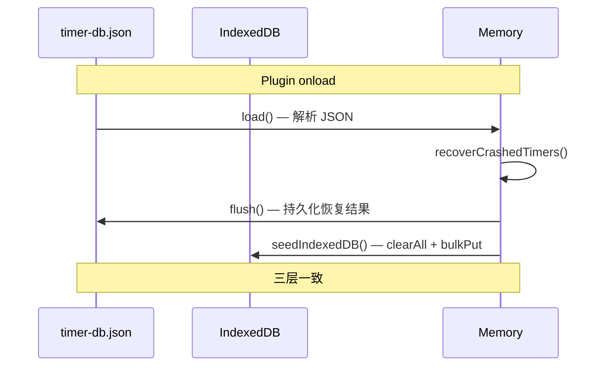

# 📊 数据设计文档: Core Timer

**文档版本**: v1.0  |  **创建日期**: 2026-03-02  |  **状态**: 补充归档  |  **对应 PRD**: stage1-PRD.md

> 本文档为已上线核心计时器功能的数据 schema 归档，描述三层数据存储的实际结构。

---

## 一、现有 Schema 分析

### 1.1 Markdown HTML Span（源数据层）

```html
<span class="timer-r" id="LzHk3a" data-dur="3600" data-ts="1740456240">【⏳01:00:00 】</span>
<span class="timer-p" id="LzHk3a" data-dur="3600" data-ts="1740456240" data-project="alpha">【💐01:00:00 】</span>
```

| 属性 | 类型 | 说明 |
|------|------|------|
| `class` | `timer-r` \| `timer-p` | 运行状态 |
| `id` | string | Base62 压缩时间戳 ID |
| `data-dur` | number | 累计时长（秒） |
| `data-ts` | number | 最后状态变更 Unix 时间戳（秒） |
| `data-project` | string \| undefined | 可选，项目标签 |

### 1.2 JSON 层（timer-db.json）

**文件路径**：`{vault}/.obsidian/plugins/text-block-timer/timer-db.json`

```typescript
interface TimerDbFile {
    version: number;            // 当前版本 2
    lastFullScan: string;       // 最近全量扫描时间（ISO 格式）
    timers: Record<string, TimerEntry>;   // timer_id → entry
    daily_dur: Record<string, Record<string, number>>; // date → { timer_id → seconds }
}
```

**timers 表**：

| 字段 | 类型 | 必填 | 说明 |
|------|------|------|------|
| `timer_id` | string | ✅ | 主键，Base62 压缩 ID |
| `file_path` | string | ✅ | 相对于 vault 根目录的文件路径 |
| `line_num` | number | ✅ | 0-indexed 行号 |
| `line_text` | string | ✅ | 行文本摘要（去除 timer span 后的纯文本） |
| `project` | string \| null | — | 项目标签 |
| `state` | enum | ✅ | `running` / `paused` / `deleted` / `lost` |
| `total_dur_sec` | number | ✅ | 累计总时长（秒） |
| `last_ts` | number | ✅ | 最近状态变更 Unix 时间戳 |
| `created_at` | number | ✅ | 创建时间 Unix 时间戳 |
| `updated_at` | number | ✅ | 最近更新时间 Unix 时间戳 |

**daily_dur 表**：

```json
{
    "2026-03-01": { "LzHk3a": 3600, "Abc123": 1800 },
    "2026-03-02": { "LzHk3a": 900 }
}
```

- 外层 key：日期 `YYYY-MM-DD`
- 内层 key：timer_id
- value：该 timer 在该日期的累计秒数

**内存辅助结构**：

| 结构 | 类型 | 说明 |
|------|------|------|
| `timersByFile` | `Map<filePath, Set<timerId>>` | 按文件路径索引 timers，加速 removeFile/renameFile |
| `sessionStartDate` | `Map<timerId, string>` | 当前 running session 的开始日期（用于跨天检测） |
| `sessionStartTs` | `Map<timerId, number>` | 当前 running session 的开始时间戳 |

### 1.3 IndexedDB 层（TimerPluginDB）

**数据库名**：`text-block-timer`，版本：1

**timers store**：

| 字段 | 类型 | 说明 |
|------|------|------|
| `timer_id` | string | keyPath（主键） |
| `file_path` | string | 文件路径 |
| `line_num` | number | 行号 |
| `line_text` | string | 行文本摘要 |
| `project` | string \| null | 项目标签 |
| `state` | enum | running / paused / deleted / lost |
| `total_dur_sec` | number | 累计总时长（秒） |
| `last_ts` | number | 最近状态变更时间戳 |
| `created_at` | number | 创建时间 |
| `updated_at` | number | 更新时间 |

**daily_dur store**：

| 字段 | 类型 | 说明 |
|------|------|------|
| `key` | string | keyPath，格式 `${timer_id}\|${stat_date}` |
| `timer_id` | string | 关联 timers.timer_id |
| `stat_date` | string | YYYY-MM-DD |
| `duration_sec` | number | 累计秒数 |

**索引**：
- `by_timer`：`timer_id`（非唯一），用于按 timer 查询
- `by_date`：`stat_date`（非唯一），用于按日期聚合

---

## 二、三层同步策略

### 2.1 写入频率

| 操作 | Markdown | JSON | IndexedDB |
|------|----------|------|-----------|
| 创建（init） | ✅ 立即写入 span | ✅ scheduleFlush(100ms) | ✅ async fire-and-forget |
| 继续（continue） | ✅ 立即 | ✅ scheduleFlush | ✅ async |
| 暂停（pause） | ✅ 立即 | ✅ scheduleFlush | ✅ async |
| 每秒 tick | ✅ 每秒更新 span | ❌ 仅内存更新 | ✅ tickUpdate（原子事务） |
| 时间调整 | ✅ 立即 | ✅ flush | ✅ async |
| onunload | ❌ 不写 | ✅ flushSync | ❌ 异步不可靠 |

### 2.2 权威性

| 场景 | 权威来源 |
|------|----------|
| 运行中实时 dur | Markdown span（每秒更新） |
| 持久化状态 | JSON（onunload 时 flushSync） |
| 实时查询（sidebar/status bar） | IndexedDB（每秒 tickUpdate） |
| daily_dur | IndexedDB（tick 级精度）= JSON（state change 级精度） |

### 2.3 启动时数据流



---

## 三、数据迁移方案

### 3.1 v1 → v2 格式升级（Markdown span）

| 项目 | v1 | v2 |
|------|----|----|
| class | `timer-btn` | `timer-r` / `timer-p` |
| ID 属性 | `timerId` 或 `data-timerId` | `id` |
| 状态 | `Status="Running"/"Paused"` | class 值区分 |
| 时长 | `AccumulatedTime` 或 `data-AccumulatedTime` | `data-dur` |
| 时间戳 | `currentStartTimeStamp` | `data-ts` |

**升级逻辑**：`TimerFileManager.upgradeOldTimers()` 在文件打开时自动扫描 v1 span，重新生成 Base62 ID 并替换为 v2 格式。

### 3.2 legacy sessions 迁移（JSON）

旧版 JSON 使用 `sessions[]` 数组，新版使用 `daily_dur` 结构。`TimerDatabase.load()` 在检测到 `sessions` 字段时自动迁移到 `daily_dur`，然后删除 `sessions`。

### 3.3 Checkbox 路径控制迁移

旧版使用 `checkboxToTimerPathRestriction`（disable/whitelist/blacklist）+ `pathRestrictionPaths`。新版使用 `checkboxPathGroups`（文件组数组）。`checkPathRestriction()` 在首次调用时检测旧格式并自动迁移为名为 "Migrated" 的文件组。

---

## 四、查询场景分析

| 场景 | 查询条件 | 数据来源 | 期望响应时间 |
|------|----------|----------|-------------|
| Sidebar 当前文件计时器 | filePath + state ∈ {running, paused} | 实时扫描 Markdown | < 50ms |
| Sidebar 当前会话计时器 | 多个 filePath + state | 实时扫描 Markdown | < 100ms |
| Sidebar 全库计时器 | state ∈ {running, paused} | JSON timers 表 | < 200ms |
| 状态栏更新 | 所有 running timers | Memory (TimerManager) | < 5ms |
| 每秒 tick 更新 | 单个 timerId | Memory + IDB | < 10ms |
| daily_dur 图表 | timerId + date range | IDB by_timer 索引 | < 50ms |

---

## 五、异常恢复方案

| 异常 | 恢复策略 |
|------|----------|
| Obsidian 崩溃 | `recoverCrashedTimers()` 检测 JSON 中 state=running 的记录，计算 crash 期间时长，结算到 daily_dur |
| JSON 文件损坏 | load() catch → 创建空数据库 |
| IDB 不可用 | 降级为纯 JSON 模式，侧边栏/图表功能受限 |
| 文件被外部修改 | `findTimerGlobally()` 全文搜索兜底 |
