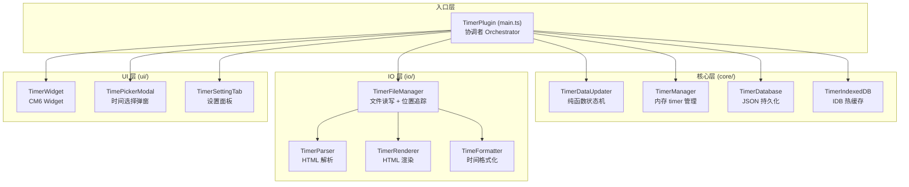
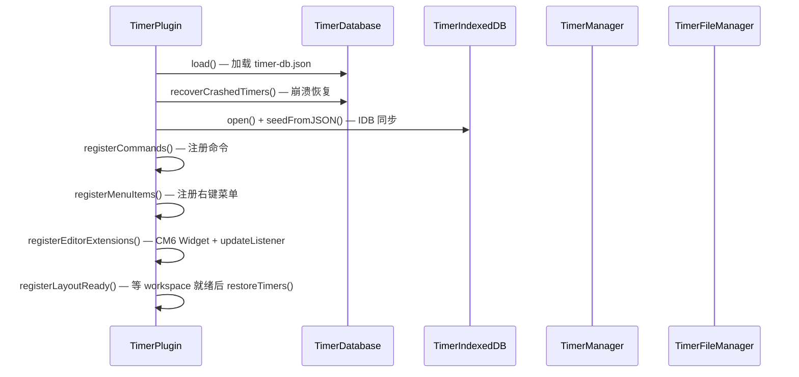
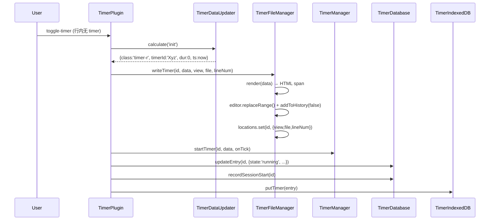
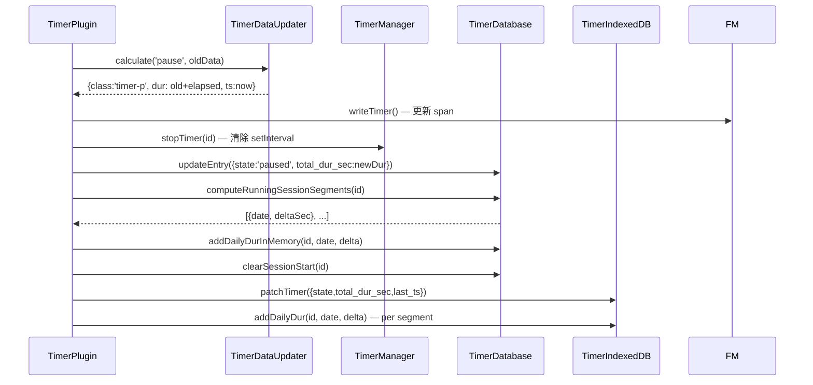
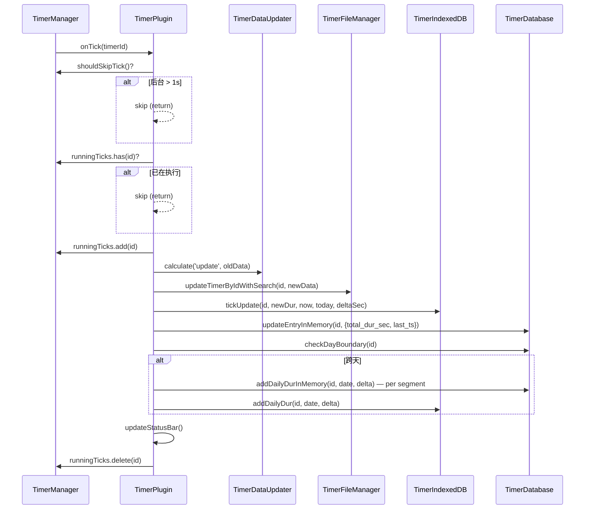
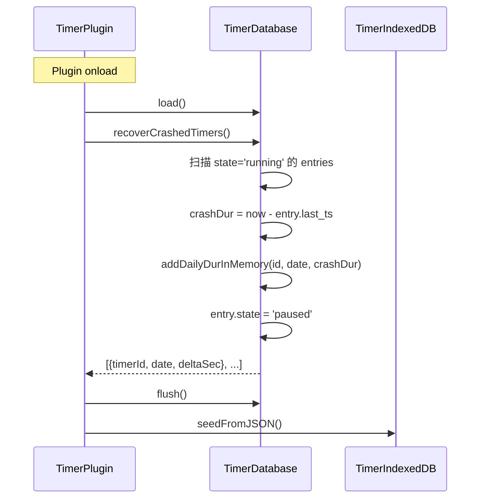

# 🔧 技术方案: Core Timer

**文档版本**: v1.0  |  **创建日期**: 2026-03-02  |  **状态**: 补充归档（基于实际代码）

> 本文档为已上线核心计时器功能的技术方案归档，完全基于实际代码结构描述。

---

## 一、架构概览

### 1.1 分层架构



### 1.2 核心设计原则

| 原则 | 实现 |
|------|------|
| 纯函数状态机 | `TimerDataUpdater.calculate()` 无副作用，仅输入→输出 |
| 三层数据分离 | Markdown（源）↔ JSON（冷持久化）↔ IDB（热缓存） |
| 协调者模式 | `TimerPlugin` 不持有业务状态，仅协调各模块 |
| 位置缓存 + 全文兜底 | `TimerFileManager.locations` 缓存行号，失效时全文搜索 |
| 后台节流 | `document.visibilitychange` 监听，后台 > 1s 跳过 tick |

---

## 二、核心模块设计

### 2.1 TimerPlugin — 主协调者

**文件**: `src/main.ts`  
**职责**: 注册命令/菜单/事件，协调各模块完成业务流程

**关键方法**:

| 方法 | 触发场景 | 核心逻辑 |
|------|----------|----------|
| `handleStart(editor, file)` | 命令面板/右键菜单 | TimerDataUpdater.calculate('init') → fileManager.writeTimer() → manager.startTimer() → db.updateEntry() → idb.putTimer() |
| `handlePause(editor, file, timerId)` | 同上 | calculate('pause') → writeTimer() → manager.stopTimer() → db.updateEntry() + addDailyDur → idb.patchTimer() + addDailyDur |
| `handleContinue(editor, file, timerId)` | 同上 | calculate('continue') → writeTimer() → manager.startTimer() → db.updateEntry() → idb.patchTimer() |
| `handleSetDuration(timerId)` | 右键菜单 | TimePickerModal → calculate('setDuration') → writeTimer() → db.updateEntry() + adjustDailyDur → idb同步 |
| `onTick(timerId)` | setInterval 每秒 | shouldSkipTick() → calculate('update') → fileManager.updateTimerByIdWithSearch() → idb.tickUpdate() → db.updateEntryInMemory() → checkDayBoundary() |
| `restoreTimers()` | 文件打开 | 扫描所有 tab → parse timer span → 按 autoStopTimers 策略 restore/forcepause |
| `toggleTimerbyCheckboxState()` | EditorView.updateListener | 检测 checkbox 状态字符变更 → 路径控制检查 → handleStart/handlePause/handleContinue |

**onload 启动序列**:



### 2.2 TimerDataUpdater — 纯函数状态机

**文件**: `src/core/TimerDataUpdater.ts`

```typescript
interface TimerData {
    class: 'timer-r' | 'timer-p';
    timerId: string;
    dur: number;        // 累计秒数
    ts: number;         // Unix timestamp (秒)
    project?: string | null;
    beforeIndex?: number;  // 解析位置
    afterIndex?: number;
}

type TimerAction = 'init' | 'continue' | 'pause' | 'update' | 'restore' | 'forcepause' | 'setDuration';
```

**状态转换矩阵**:

| Action | 输入状态 | class | dur 计算 | ts 计算 |
|--------|---------|-------|----------|---------|
| init | — | timer-r | 0 | now |
| continue | timer-p | timer-r | 不变 | now |
| pause | timer-r | timer-p | old.dur + (now - old.ts) | now |
| update | timer-r | timer-r | old.dur + (now - old.ts) | now |
| restore | timer-p | timer-r | old.dur + (now - old.ts) | now |
| forcepause | any | timer-p | 不变 | 不变 |
| setDuration | timer-p | timer-p | newDur | 不变 |

### 2.3 TimerManager — 内存 Timer 管理

**文件**: `src/core/TimerManager.ts`

- `timers: Map<timerId, {intervalId, data}>` — 所有运行中的 timer
- `startedIds: Set<timerId>` — 本次 onload session 启动过的 timer（用于 quit 模式）
- `runningTicks: Set<timerId>` — 当前正在执行 tick 的 timer（防重叠）
- 页面可见性监控：`document.visibilitychange` → `isVisible` / `lastVisibleTime`
- `shouldSkipTick()`: 后台 > 1s 返回 true

### 2.4 TimerDatabase — JSON 持久化

**文件**: `src/core/TimerDatabase.ts`

**写入策略**:
- `updateEntry()`: scheduleFlush(100ms debounce) — 状态变更
- `updateEntryInMemory()`: 仅内存更新 — tick 时使用
- `flushSync()`: 同步写文件系统 — onunload 使用
- `addDailyDurInMemory()`: 累加到 daily_dur — pause/tick 时

**内存索引**:
- `timersByFile: Map<filePath, Set<timerId>>` — O(1) 按文件查询
- `sessionStartDate / sessionStartTs` — 跨天检测辅助

**关键功能**:
- `recoverCrashedTimers()`: 检测 state=running 的遗留记录，计算 crash 时长，结算到 daily_dur
- `checkDayBoundary()`: 检测跨天，拆分 segments（每日一条）
- `adjustDailyDurForSetDuration()`: 时间调整的 LIFO 扣除

### 2.5 TimerIndexedDB — IDB 热缓存

**文件**: `src/core/TimerIndexedDB.ts`

- `tickUpdate()`: 原子事务同时更新 timers store（dur/ts）和 daily_dur store（delta）
- `adjustDailyDurForSetDuration()`: 与 JSON 层同算法的 IDB 版本
- 按 `by_timer` / `by_date` 索引查询

### 2.6 TimerFileManager — 文件读写

**文件**: `src/io/TimerFileManager.ts`

**位置缓存**: `locations: Map<timerId, {view, file, lineNum}>`
- 创建/恢复/继续时缓存
- 每次 tick 时先用缓存位置更新，失败则 fallback 全文搜索

**双模式写入**:
- 编辑模式: `editor.replaceRange()` — CM6 dispatch
- 预览模式: `vault.read()` + `vault.modify()` — Vault API

**upgradeOldTimers()**: 
- 扫描当前文件，找到 v1 格式 span（`.timer-btn`）
- 生成新 Base62 ID，用 v2 格式替换
- 同时更新 JSON/IDB

### 2.7 TimerParser / TimerRenderer — 解析与渲染

**TimerParser** (`src/io/TimerParser.ts`):
- 使用 `document.createElement('template')` + DOM querySelector 解析 HTML
- 支持 v1（timer-btn class）和 v2（timer-r/timer-p class）双格式
- 返回 TimerData 含 `beforeIndex` / `afterIndex` 用于精确替换

**TimerRenderer** (`src/io/TimerRenderer.ts`):
- 纯函数，输入 TimerData + Settings → 输出 HTML string
- 格式: `<span class="timer-r" id="X" data-dur="N" data-ts="N">【⏳HH:MM:SS 】</span>`
- 支持自定义图标、时间格式（full/smart）

### 2.8 CM6 Widget 系统

**文件**: `src/ui/TimerWidget.ts`

**三个 CM6 扩展**:

1. **timerFoldingField** (StateField + DecorationSet):
   - 正则匹配行内 timer span
   - 替换为 `TimerWidget` Decoration（Decoration.replace）
   - 随 editor state 更新自动重建

2. **timerCursorEscape** (EditorView.updateListener):
   - 检测光标位置是否落入 timer span 范围内
   - 如果是，自动将光标移动到最近的外边界（左/右）

3. **timerWidgetKeymap** (keymap):
   - `Backspace`: 检测左侧紧邻 timer span → 删除整个 span
   - `Delete`: 检测右侧紧邻 timer span → 删除整个 span
   - `ArrowLeft/ArrowRight`: 检测相邻 timer span → 跳过

### 2.9 TimePickerModal — 时间调整弹窗

**文件**: `src/ui/TimePickerModal.ts`

- iPhone 风格滚轮选择器，3 列（时/分/秒）
- 支持 mouse wheel / touch drag / click 三种交互
- 惯性动画（velocity tracking + momentum）
- 选中项视觉高亮（放大 + 粗体 + 高对比度）
- 确认回调返回总秒数，由 handleSetDuration 处理同步

### 2.10 Checkbox 联动

**实现位置**: `src/main.ts` 中 `toggleTimerbyCheckboxState()`

**编辑模式**:
- EditorView.updateListener 检测文档变更
- 逐个 ChangeSet 检查 checkbox 行
- 提取旧/新 checkbox 状态字符（`/`、`x`、`-` 等）
- 匹配 `runningCheckboxState` / `pausedCheckboxState` 配置

**预览模式**:
- 注册 `pointerdown` DOM 事件
- 检测点击目标是否为 checkbox input
- 轮询文件内容变更（Vault API），确认状态变化后触发

**路径控制**:
- `checkPathRestriction(filePath)`: 遍历 `checkboxPathGroups`
- 每个组包含 whitelist/blacklist patterns
- pattern 支持正则（`/pattern/`）和前缀匹配
- 文件匹配**任意一个组**即可启用

### 2.11 设置面板

**文件**: `src/ui/TimerSettingTab.ts`

- 使用 Obsidian `PluginSettingTab` API
- 4 个分区：基础 / Checkbox / 外观 / 状态栏
- 文件组管理：折叠/展开卡片 + 动态增删 pattern 输入框
- 颜色选择器：使用原生 `<input type="color">`
- 修改立即 `saveSettings()` + `app.workspace.trigger('css-change')`

---

## 三、关键流程详解

### 3.1 创建计时器



### 3.2 暂停计时器



### 3.3 每秒 Tick



### 3.4 崩溃恢复



### 3.5 文件打开恢复

```
restoreTimers():
  for each open tab:
    for each line in file:
      parsed = TimerParser.parse(line)
      if parsed.class === 'timer-r':
        switch autoStopTimers:
          'never'  → handleRestore(id)  // 恢复运行
          'quit'   → if startedIds.has(id): handleRestore(id)
                     else: handleForcePause(id)
          'close'  → handleForcePause(id)
```

---

## 四、性能优化策略

| 策略 | 实现 |
|------|------|
| 位置缓存 | `fileManager.locations` Map 缓存 timerId → lineNum，避免每秒全文搜索 |
| 全文搜索兜底 | 缓存失效时 `findTimerGlobally()` 搜索所有打开标签页 |
| tick 防重叠 | `runningTicks: Set` 阻止同一 timer 的并发 tick |
| 后台节流 | `visibilitychange` + 1s 阈值 |
| JSON 内存更新 | tick 只调用 `updateEntryInMemory()`，不触发 disk flush |
| IDB 原子事务 | `tickUpdate()` 一个事务同时写 timers + daily_dur |
| debounce flush | `scheduleFlush(100ms)` 合并多次写入 |
| CM6 decoration 增量更新 | StateField 仅在文档/viewport 变更时重建 DecorationSet |

---

## 五、错误处理

| 场景 | 处理 |
|------|------|
| Markdown 解析失败 | TimerParser 返回 null → 调用方跳过 |
| 缓存位置失效 | updateTimerByIdWithSearch fallback 到 findTimerGlobally |
| 全文搜索仍未找到 | 记 lost 状态，不 crash |
| JSON 文件损坏 | load() catch → 创建空数据库 |
| IDB 不可用 | 所有 IDB 操作 catch → 静默降级 |
| 预览模式无 editor | 走 vault.read/modify 路径 |

---

## 六、测试策略

- **纯函数单元测试**: TimerDataUpdater 的 7 种 action
- **E2E 测试**: 基于 CDP 协议连接 Obsidian，模拟用户操作
- **测试链**: basic → adjust → seed → delete → passive_delete → crossday → crossday_adjust
