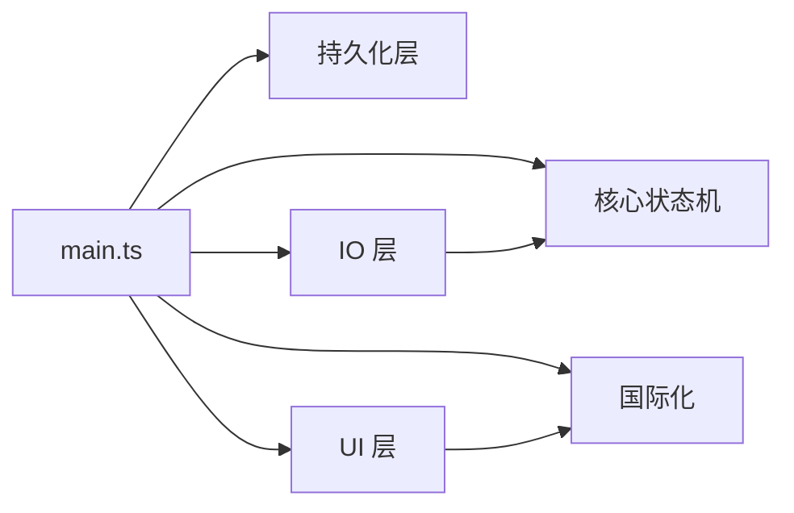

# 📦 实施计划: Core Timer

**文档版本**: v1.0  |  **创建日期**: 2026-03-02  |  **状态**: 补充归档

> 本文档为已上线核心计时器功能的实施计划归档，描述实际的模块划分和文件分布。

---

## 一、模块分拆

### Module 1: 核心状态机与数据模型

| 文件 | 内容 |
|------|------|
| `src/core/TimerDataUpdater.ts` | 纯函数状态机（init/continue/pause/update/restore/forcepause/setDuration） |
| `src/core/TimerManager.ts` | 内存 timer 管理（Map + setInterval + 可见性监控 + tick 防重叠） |
| `src/core/constants.ts` | 全局常量（UPDATE_INTERVAL、DEBUG 等） |
| `src/core/utils.ts` | 工具函数（compressId 等） |

### Module 2: 持久化层

| 文件 | 内容 |
|------|------|
| `src/core/TimerDatabase.ts` | JSON 文件持久化（CRUD、daily_dur、session tracking、崩溃恢复、跨天检测） |
| `src/core/TimerIndexedDB.ts` | IndexedDB 热缓存（timers + daily_dur stores、tickUpdate 原子事务） |

### Module 3: IO 层

| 文件 | 内容 |
|------|------|
| `src/io/TimerParser.ts` | HTML span 解析（v1/v2 双格式、DOM 解析） |
| `src/io/TimerRenderer.ts` | HTML span 渲染（TimerData → HTML string） |
| `src/io/TimerFileManager.ts` | 文件读写（位置缓存、编辑/预览双模式、旧格式升级、插入位置计算） |
| `src/io/TimeFormatter.ts` | 时间格式化（full/smart 两种格式） |

### Module 4: UI 层

| 文件 | 内容 |
|------|------|
| `src/ui/TimerWidget.ts` | CM6 Widget（folding field + cursor escape + keymap） |
| `src/ui/TimePickerModal.ts` | 时间选择弹窗（iPhone 风格滚轮） |
| `src/ui/TimerSettingTab.ts` | 设置面板（基础/Checkbox/外观/状态栏 4 个分区） |

### Module 5: 国际化

| 文件 | 内容 |
|------|------|
| `src/i18n/translations.ts` | 翻译表（en/zh/zhTW/ja/ko）+ getTranslation() |

### Module 6: 主协调者

| 文件 | 内容 |
|------|------|
| `src/main.ts` | TimerPlugin 主类（命令注册、事件监听、业务流程协调、Checkbox 联动、恢复/崩溃恢复、状态栏） |

---

## 二、模块依赖图

---

## 三、测试覆盖计划

| 模块 | 测试类型 | 现有覆盖 | 待补充 |
|------|----------|----------|--------|
| Module 1 (状态机) | E2E | ✅ basic chain | 无 |
| Module 2 (持久化) | E2E | ✅ basic/adjust/seed/crossday | ✅ 需补充 IDB 验证 |
| Module 3 (IO) | E2E | ✅ basic（写入验证） | 无 |
| Module 4 (UI) | E2E | ⚠️ Widget 未测 | ✅ 需补充 Widget/设置面板 |
| Module 5 (i18n) | — | ❌ 未测 | ✅ 待补充 |
| Module 6 (协调者) | E2E | ✅ 多 chain 覆盖 | ✅ 需补充 Checkbox 联动/恢复 |

---

## 四、已有 E2E 测试链

| 测试链 | 覆盖范围 | 归属功能 |
|--------|----------|----------|
| preflight | 连接验证、环境准备 | 基础设施 |
| basic | 创建/暂停/继续/tick/JSON 验证 | ✅ Core Timer |
| adjust | 时间调整（增加/减少/daily_dur 联动） | ✅ Core Timer |
| seed | IDB seeding/daily_dur 验证 | ✅ Core Timer |
| crossday | 跨天边界检测 | ✅ Core Timer |
| crossday_adjust | 跨天 + 时间调整 LIFO | ✅ Core Timer |
| passive_delete | 被动删除/恢复/span class 一致性 | Delete Enhancement |
| delete | 主动删除 | Delete Enhancement |
| sidebar_tabs | Sidebar 标签页 | Sidebar |
| readonly | 只读模式 | Sidebar |
