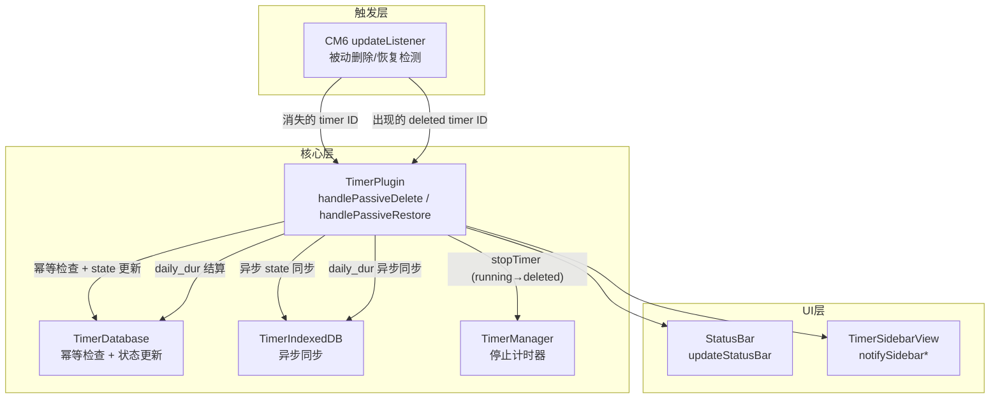
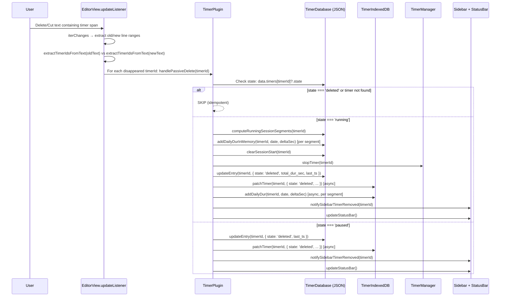
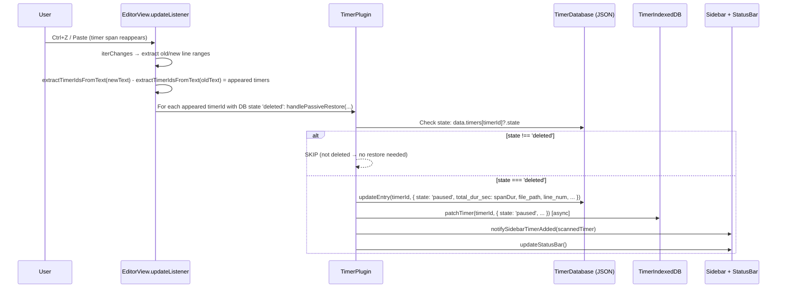

# 🛠️ 技术设计文档：删除计时器功能扩展（Delete Timer Enhancement）

**文档版本**: v1.0 | **创建日期**: 2026-03-02 | **对应 PRD**: stage1-PRD.md v1.0 | **状态**: 草稿

---

## 一、PRD 技术方案勘误

> PRD 第十章"技术实现要点"由产品经理撰写，本节逐一核查并补充技术细节。

### 1.1 检测机制的范围精度

**PRD 原文**：
> 利用 CM6 `EditorView.updateListener` + `update.changes.iterChanges` 获取变更行范围，比较旧文档/新文档中的 timer span 差异

**补充说明**：
`iterChanges` 返回的是字符范围 `(oldFrom, oldTo, newFrom, newTo)`，需要通过 `doc.lineAt()` 转换为行范围。对于跨多行的变更（如多行选中删除），需要遍历受影响的每一行来检测 timer span。

**关键细节**：
- 使用**正则表达式**（而非 DOM 解析）从行文本中提取 timer ID，避免在 updateListener 热路径上创建 DOM 节点
- 正则：`/class="timer-[rp]"[^>]*id="([^"]+)"/g` 和 `/id="([^"]+)"[^>]*class="timer-[rp]"/g`（属性顺序不固定）

### 1.2 恢复机制复用程度

**PRD 原文**：
> 已有 `handleRestore` 可参考，但恢复到 `paused` 而非 `running`

**技术评估**：
现有 `handleRestore` 将计时器恢复为 `running` 状态（调用 `TimerDataUpdater.calculate('restore', ...)`），且需要 `view` 和 `lineNum` 参数。被动恢复需要的是：
1. 恢复为 `paused`（不启动计时器）
2. 从 span 属性读取 `data-dur` 和 `data-ts` 作为权威数据
3. 更新 `file_path` 和 `line_num`（可能恢复到新位置）
4. 不需要调用 `TimerManager`、`TimerFileManager`（span 已经在文档中了）

因此**不复用** `handleRestore`，而是实现一个独立的 `handlePassiveRestore` 方法，更轻量。

### 1.3 幂等检查时机

**PRD 原文**：
> 幂等保障：所有删除/恢复操作前先检查 JSON 内存层中的当前 state

**补充说明**：
幂等检查必须在执行任何副作用之前（特别是 `computeRunningSessionSegments` 之前），因为重复调用 session 计算可能产生重复的 daily_dur 条目。检查顺序：
1. 读取 `this.database.getEntry(timerId)?.state`（同步）
2. 若已是目标状态则立即 return
3. 否则执行后续操作

---

## 二、架构概述

### 2.1 受影响的模块

| 文件 | 变更类型 | 变更摘要 |
|------|----------|----------|
| `src/main.ts` | **扩展** | 新增 `handlePassiveDelete`、`handlePassiveRestore` 方法；新增 `registerPassiveDeletionDetector` 注册 CM6 updateListener |
| `src/core/TimerDatabase.ts` | **扩展** | 新增 `getEntry(timerId)` 公开查询方法（Arch Review Issue-1 修复） |
| `src/core/TimerIndexedDB.ts` | **无变更** | 现有接口完全满足需求 |
| `src/core/TimerManager.ts` | **无变更** | `stopTimer` 已存在 |
| `src/io/TimerParser.ts` | **无变更** | `parse` 方法已存在 |

### 2.2 新增模块

无新增文件。所有新增逻辑在 `src/main.ts` 中实现（遵循现有的"协调者模式"——核心逻辑集中在 TimerPlugin 主类中）。

### 2.3 模块依赖关系图



---

## 三、接口设计

### 3.1 新增公开接口

#### `TimerPlugin.handlePassiveDelete(timerId: string): void`

```typescript
/**
 * Handle passive deletion detected by CM6 updateListener.
 * Called when a timer span disappears from the document due to user editing.
 * Idempotent: skips if timer is already in 'deleted' state.
 *
 * @param timerId - The ID of the timer that disappeared
 */
handlePassiveDelete(timerId: string): void
```

#### `TimerPlugin.handlePassiveRestore(timerId: string, spanDur: number, spanTs: number, filePath: string, lineNum: number, project: string | null): void`

```typescript
/**
 * Handle passive restoration detected by CM6 updateListener.
 * Called when a previously deleted timer span reappears in the document (e.g., Ctrl+Z).
 * Idempotent: skips if timer is not in 'deleted' state.
 * Restores timer to 'paused' state (never auto-resumes to 'running').
 *
 * @param timerId - The timer ID from the span
 * @param spanDur - Duration from span's data-dur attribute (authoritative)
 * @param spanTs - Timestamp from span's data-ts attribute
 * @param filePath - File path where the span reappeared
 * @param lineNum - Line number (0-based) where the span reappeared
 * @param project - Project from span's data-project attribute
 */
handlePassiveRestore(timerId: string, spanDur: number, spanTs: number, filePath: string, lineNum: number, project: string | null): void
```

### 3.2 内部接口

#### `TimerPlugin.registerPassiveDeletionDetector(): void`

```typescript
/**
 * Register a CM6 EditorView.updateListener extension that detects
 * timer spans disappearing or reappearing in document changes.
 * Called once in onload().
 */
private registerPassiveDeletionDetector(): void
```

#### Helper: `extractTimerIdsFromText(text: string): Map<string, { dur: number; ts: number; project: string | null }>`

```typescript
/**
 * Extract timer IDs and their attributes from a text fragment using regex.
 * Lightweight — no DOM parsing, suitable for hot path.
 *
 * @param text - Raw text to scan for timer spans
 * @returns Map of timerId → { dur, ts, project }
 */
function extractTimerIdsFromText(text: string): Map<string, { dur: number; ts: number; project: string | null }>
```

---

## 四、数据流设计

### 4.1 被动删除数据流



### 4.2 被动恢复数据流



### 4.3 状态机扩展

现有状态转换 + 本次新增的被动转换（用 `*` 标注）：

```
              handleStart
    (none) ──────────────→ running
                              │
            handleContinue    │ handlePause
    paused ←─────────────── running
       │                      │
       │   handleDelete       │ handleDelete
       └──────────────→ deleted ←──────────┘
                          │  ↑
         *handlePassive   │  │  *handlePassive
          Restore         │  │   Delete
                          ↓  │
                        paused
```

---

## 五、详细实现设计

### 5.1 `extractTimerIdsFromText` — 轻量级正则提取

```typescript
/**
 * Regex-based timer ID extraction from text.
 * Handles both attribute orders: class before id, and id before class.
 * Returns a Map of timerId → { dur, ts, project }.
 */
function extractTimerIdsFromText(text: string): Map<string, { dur: number; ts: number; project: string | null }> {
    const result = new Map<string, { dur: number; ts: number; project: string | null }>();
    // Match timer spans: <span class="timer-[rp]" id="..." data-dur="..." data-ts="..." ...>
    const spanRegex = /<span\s+[^>]*class="timer-[rp]"[^>]*>/g;
    let match;
    while ((match = spanRegex.exec(text)) !== null) {
        const spanTag = match[0];
        const idMatch = spanTag.match(/\bid="([^"]+)"/);
        const durMatch = spanTag.match(/data-dur="([^"]+)"/);
        const tsMatch = spanTag.match(/data-ts="([^"]+)"/);
        const projMatch = spanTag.match(/data-project="([^"]+)"/);
        if (idMatch) {
            result.set(idMatch[1], {
                dur: durMatch ? parseInt(durMatch[1], 10) : 0,
                ts: tsMatch ? parseInt(tsMatch[1], 10) : 0,
                project: projMatch ? projMatch[1] : null
            });
        }
    }
    return result;
}
```

**设计决策**：
- 使用正则而非 `TimerParser.parse()`（后者内部使用 `document.createElement('template')` 创建 DOM 节点）
- 在 updateListener 热路径上避免 DOM 操作，确保 < 1ms 开销
- 只需要 ID + 属性，不需要完整的 `TimerData`（如 `beforeIndex`/`afterIndex`）

### 5.2 `registerPassiveDeletionDetector` — CM6 updateListener 注册

```typescript
private registerPassiveDeletionDetector(): void {
    this.registerEditorExtension(
        EditorView.updateListener.of((update) => {
            if (!update.docChanged) return;

            const oldDoc = update.startState.doc;
            const newDoc = update.state.doc;

            // Get active file path for restore context
            const view = this.app.workspace.getActiveViewOfType(FileView);
            const filePath = (view as any)?.file?.path ?? '';

            update.changes.iterChanges((oldFrom, oldTo, newFrom, newTo) => {
                // Extract affected line ranges in old and new documents
                const oldStartLine = oldDoc.lineAt(oldFrom).number;
                const oldEndLine = oldDoc.lineAt(Math.min(oldTo, oldDoc.length)).number;
                const newStartLine = newDoc.lineAt(newFrom).number;
                const newEndLine = newDoc.lineAt(Math.min(newTo, newDoc.length)).number;

                // Collect old text (lines that were replaced/deleted)
                let oldText = '';
                for (let ln = oldStartLine; ln <= oldEndLine; ln++) {
                    oldText += oldDoc.line(ln).text + '\n';
                }

                // Collect new text (lines that replaced/were inserted)
                let newText = '';
                for (let ln = newStartLine; ln <= newEndLine; ln++) {
                    newText += newDoc.line(ln).text + '\n';
                }

                const oldTimers = extractTimerIdsFromText(oldText);
                const newTimers = extractTimerIdsFromText(newText);

                // Detect disappeared timers → passive delete
                for (const [timerId] of oldTimers) {
                    if (!newTimers.has(timerId)) {
                        this.handlePassiveDelete(timerId);
                    }
                }

                // Detect appeared timers → passive restore (if was deleted)
                for (const [timerId, attrs] of newTimers) {
                    if (!oldTimers.has(timerId)) {
                        const entry = this.database.getEntry(timerId);
                        if (entry && entry.state === 'deleted') {
                            // Calculate line number in the new doc
                            // Find which line within newStartLine..newEndLine contains this timer
                            let timerLineNum = newStartLine - 1; // 0-based
                            for (let ln = newStartLine; ln <= newEndLine; ln++) {
                                const lineText = newDoc.line(ln).text;
                                if (lineText.includes(`id="${timerId}"`)) {
                                    timerLineNum = ln - 1; // CM6 lines are 1-based, our lineNum is 0-based
                                    break;
                                }
                            }
                            this.handlePassiveRestore(
                                timerId,
                                attrs.dur,
                                attrs.ts,
                                filePath,
                                timerLineNum,
                                attrs.project
                            );
                        }
                    }
                }
            });
        })
    );
}
```

**设计决策**：
- **不使用 debounce**：CM6 updateListener 天然按事务触发，同一次用户操作（如多键删除）只产生一次 update
- **仅扫描变更行范围**：不做全文档扫描，性能开销与变更行数成正比
- **不依赖外部状态**：每次检测自包含，不需要维护"上一次的 timer 列表"

### 5.3 `handlePassiveDelete` — 被动删除处理

```typescript
handlePassiveDelete(timerId: string): void {
    // Idempotent check: skip if already deleted or not found
    const entry = this.database.getEntry(timerId);
    if (!entry || entry.state === 'deleted') return;

    const now = Math.floor(Date.now() / 1000);
    const wasRunning = entry.state === 'running';

    // If running, settle duration first
    if (wasRunning) {
        const currentData = this.manager.getTimerData(timerId);
        const totalDur = currentData ? currentData.dur : entry.total_dur_sec;

        // Compute session segments for daily_dur
        const segments = this.database.computeRunningSessionSegments(timerId);
        for (const seg of segments) {
            this.database.addDailyDurInMemory(timerId, seg.date, seg.deltaSec);
            this.idb.addDailyDur(timerId, seg.date, seg.deltaSec);
        }
        this.database.clearSessionStart(timerId);

        // Stop the in-memory timer
        this.manager.stopTimer(timerId);

        // Update state
        const patch = {
            state: 'deleted' as const,
            total_dur_sec: totalDur,
            last_ts: now,
            updated_at: now
        };
        this.database.updateEntry(timerId, patch);
        this.idb.patchTimer(timerId, patch);
    } else {
        // Paused timer: just mark deleted
        const patch = {
            state: 'deleted' as const,
            last_ts: now,
            updated_at: now
        };
        this.database.updateEntry(timerId, patch);
        this.idb.patchTimer(timerId, patch);
    }

    // Clean up file manager location
    this.fileManager.locations.delete(timerId);

    // Sync UI
    this.updateStatusBar();
    this.notifySidebarTimerRemoved(timerId);
}
```

**与现有 `handleDelete` 的区别**：
| 维度 | `handleDelete` (主动) | `handlePassiveDelete` (被动) |
|------|----------------------|------------------------------|
| 触发方式 | 命令/右键菜单 | CM6 updateListener |
| span 清理 | 从编辑器中移除 span 文本 | 不需要（用户已删除） |
| 参数 | `view`, `lineNum`, `parsedData` | 仅 `timerId` |
| 幂等检查 | 无（假设 parsedData 存在） | 有（检查 JSON state） |
| 相同的核心逻辑 | ✅ 结算时长 + 标记 deleted + 同步 UI | ✅ 完全相同 |

### 5.4 `handlePassiveRestore` — 被动恢复处理

```typescript
handlePassiveRestore(
    timerId: string,
    spanDur: number,
    spanTs: number,
    filePath: string,
    lineNum: number,
    project: string | null
): void {
    // Idempotent check: only restore if currently deleted
    const entry = this.database.getEntry(timerId);
    if (!entry || entry.state !== 'deleted') return;

    const now = Math.floor(Date.now() / 1000);

    // Restore to paused state, using span attributes as authoritative data
    const patch = {
        state: 'paused' as const,
        total_dur_sec: spanDur,
        last_ts: spanTs,
        file_path: filePath,
        line_num: lineNum,
        project: project,
        updated_at: now
    };
    this.database.updateEntry(timerId, patch);
    this.idb.patchTimer(timerId, patch);

    // Sync UI
    this.updateStatusBar();
    this.notifySidebarTimerAdded({
        timerId,
        filePath,
        lineNum,
        lineText: entry.line_text, // Reuse existing line_text from DB
        state: 'timer-p',
        dur: spanDur,
        ts: spanTs,
        project
    });
}
```

**与现有 `handleRestore` 的区别**：
| 维度 | `handleRestore` (文件恢复) | `handlePassiveRestore` (被动) |
|------|---------------------------|-------------------------------|
| 恢复后状态 | `running`（继续计时） | `paused`（需手动 continue） |
| 数据来源 | 从 span 解析 + 累加已过时间 | 仅从 span 属性读取 |
| 写文件 | 是（重写 span 为 running） | 否（span 已在文档中） |
| TimerManager | 启动 timer | 不启动 |
| 使用场景 | 文件打开时恢复 | Ctrl+Z / 粘贴后恢复 |

---

## 六、性能设计

### 6.1 性能目标

| 指标 | 目标值 | 设计保障 |
|------|--------|----------|
| updateListener 单次执行 | < 2ms | 正则提取（无 DOM）+ 仅扫描变更行 |
| 被动删除总耗时 | < 10ms | JSON 同步更新 + IDB 异步 fire-and-forget |
| 被动恢复总耗时 | < 5ms | JSON 同步更新 + IDB 异步 fire-and-forget |
| 内存增长 | 0 | 无新的持久化数据结构，仅方法级临时变量 |

### 6.2 优化策略

1. **正则替代 DOM 解析**：`extractTimerIdsFromText` 使用正则，避免 `document.createElement('template')` 的开销
2. **仅扫描变更行**：`iterChanges` 提供精确的字符范围，转换为行范围后仅扫描受影响的行
3. **早期退出**：`if (!update.docChanged) return` 在无文档变更时立即返回
4. **无 debounce**：CM6 updateListener 天然批处理，不需要额外的节流
5. **IDB 异步 fire-and-forget**：IDB 写入不阻塞主流程

### 6.3 性能风险与缓解

| 风险 | 场景 | 缓解 |
|------|------|------|
| 大段文本粘贴/删除 | 一次性删除 1000 行 | 正则扫描 1000 行文本 < 1ms，可接受 |
| 高频 Undo/Redo | 用户快速连续 Ctrl+Z/Ctrl+Y | 幂等检查确保不会重复处理，每次 < 5ms |

---

## 七、兼容性设计

### 7.1 向后兼容

- 不修改任何现有接口或方法签名
- 不修改任何现有数据结构
- 现有的 `handleDelete`（命令/右键菜单）功能不受影响
- 现有的 checkbox-to-timer updateListener 功能不受影响（两个 updateListener 独立运行）

### 7.2 数据迁移

无需数据迁移（不引入新字段或新 store）。

### 7.3 与现有 updateListener 的共存

当前已注册的 CM6 updateListener：
1. **checkbox-to-timer listener**：检测 checkbox 状态变化
2. **本需求新增**：检测 timer span 消失/出现

两个 listener 完全独立，不互相干扰：
- checkbox listener 检查 `POTENTIAL_CHECKBOX_REGEX` → 只处理 checkbox 行
- passive deletion listener 检查 timer span regex → 只处理含 timer span 的行
- 即使同一行同时有 checkbox 和 timer，两个 listener 各自处理各自的逻辑

---

## 八、错误处理

### 8.1 错误分级

| 级别 | 场景 | 处理方式 |
|------|------|----------|
| **低** | IDB patchTimer 失败 | 静默忽略，JSON 已更新，下次启动 seedFromJSON 重建 |
| **低** | IDB addDailyDur 失败 | 同上 |
| **中** | JSON flush 失败（磁盘满） | scheduleFlush 会重试，数据在内存中不会丢失 |
| **低** | extractTimerIdsFromText 正则异常 | try-catch 包裹，返回空 Map |

### 8.2 错误恢复

| 异常场景 | 恢复机制 |
|----------|----------|
| 被动删除中途崩溃（JSON 已更新为 deleted 但 IDB 未更新） | 下次启动 `seedFromJSON` 重建 IDB |
| 被动删除中途崩溃（JSON 未更新但 timer 内存已停止） | 下次启动 `recoverCrashedTimers` 将 running 状态恢复为 paused |
| 恢复中途崩溃 | 下次全量扫描时发现 span 在文档中但 DB 状态为 deleted，可由用户手动触发恢复 |

### 8.3 日志/调试

- 在 `DEBUG` 模式下，`handlePassiveDelete` 和 `handlePassiveRestore` 输出 `console.log` 日志
- 格式：`[PassiveDelete] timerId=xxx, wasRunning=true/false`
- 格式：`[PassiveRestore] timerId=xxx, spanDur=xxx, filePath=xxx`

---

## 九、实现计划

| 任务编号 | 任务名 | 前置依赖 | 预估工时 | 涉及文件 |
|---------|--------|---------|---------|---------|
| T00 | 在 `TimerDatabase` 中新增 `getEntry(timerId)` 公开查询方法 | 无 | 5min | `src/core/TimerDatabase.ts` |
| T01 | 实现 `extractTimerIdsFromText` 工具函数 | T00 | 15min | `src/main.ts` |
| T02 | 实现 `handlePassiveDelete` 方法 | T01 | 20min | `src/main.ts` |
| T03 | 实现 `handlePassiveRestore` 方法 | T01 | 15min | `src/main.ts` |
| T04 | 实现 `registerPassiveDeletionDetector` 并在 `onload` 中注册 | T02, T03 | 25min | `src/main.ts` |
| T05 | 构建验证 + E2E 测试脚本开发 | T04 | 45min | `tests/e2e-timer-test.mjs` |
