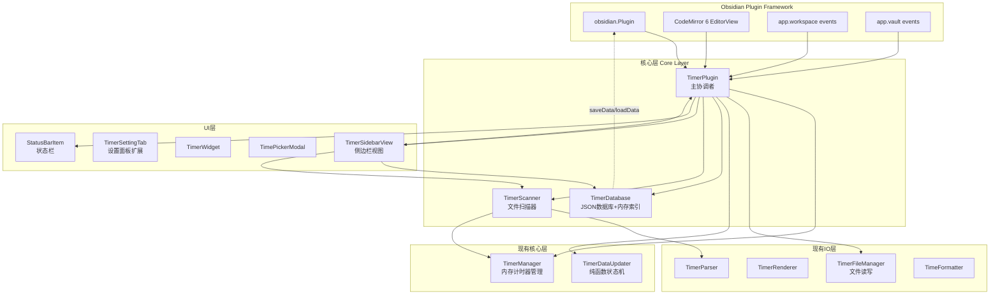
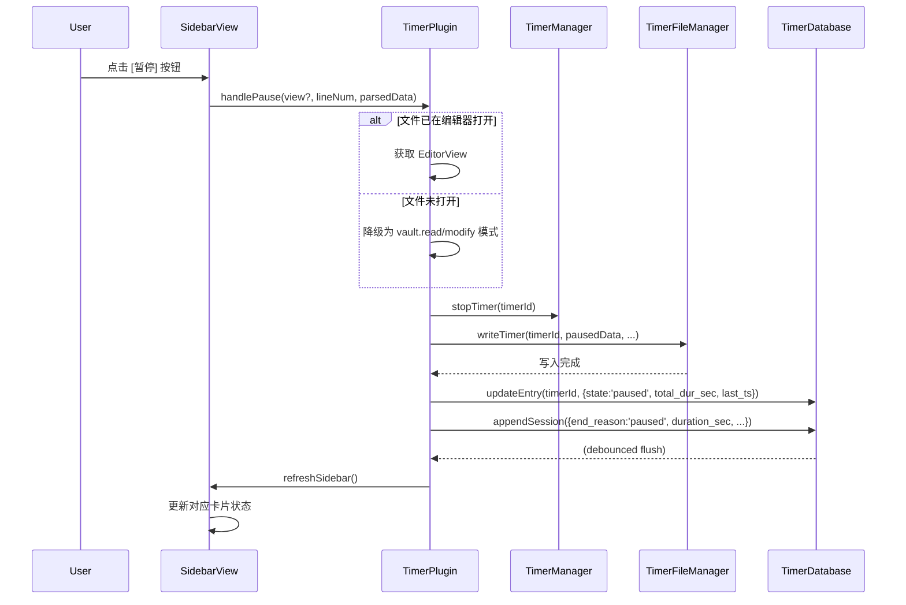
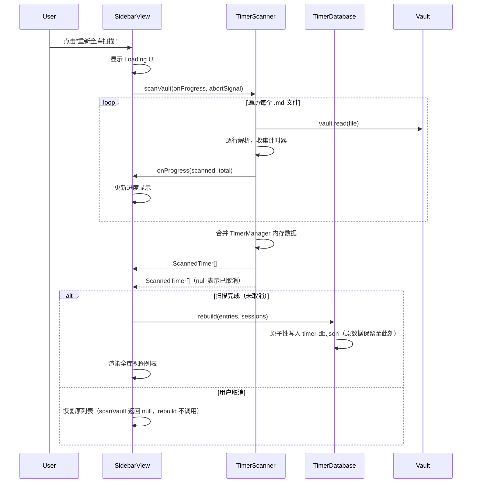

# 🛠️ 技术设计文档：Timer Sidebar

**文档版本**: v1.0
**创建日期**: 2026-02-25
**对应 PRD**: stage1-PRD.md v2.1
**状态**: 定稿

---

## 一、PRD 技术方案勘误

> PRD 第十章"技术实现要点"由产品经理撰写，存在若干技术层面的不准确之处，本节逐一说明并给出修正方案。

### 1.1 数据库存储格式

**PRD 原文**：
> 存储格式（JSON / SQLite / 其他）由开发和数仓专家决定，本文档不限定具体存储格式。

**问题**：
PRD 第十四章（埋点需求）给出了两张关系表（`timers` + `timer_sessions`），并提供了标准 SQL 聚合查询示例，隐含了 SQLite 的技术预设。但 Obsidian 插件运行在 **Electron 渲染进程**中，无法直接使用 Node.js 原生模块（如 `better-sqlite3`），引入 SQLite 需要额外的 native binding，会导致：

1. 插件包体积大幅增加（native .node 文件 ~2MB+）
2. 跨平台兼容性问题（Windows / macOS / Linux / iOS / Android 各需不同 binding）
3. 移动端（iOS/Android）完全不支持 SQLite native binding
4. 违反 Obsidian 插件社区规范（不允许 native 模块）

**修正方案**：见第二章数据库选型。

### 1.2 `timer_sessions` 跨天拆分的实现位置

**PRD 原文**：
> 每日零点（计时器仍在运行）→ 上报 `day_boundary` 记录

**问题**：
PRD 未说明零点检测的实现机制。在现有架构中，`TimerManager` 使用 `setInterval(1000ms)` 驱动 tick，但 Obsidian 在后台时会被系统节流（尤其移动端），零点时刻不一定有精确的 tick 触发。

**修正方案**：
- 零点拆分不依赖精确的零点 tick，而是在**每次 tick 时检测当前日期是否与 session 开始日期不同**
- 若检测到跨天，立即执行拆分上报，并以当前 tick 时刻作为新 session 的起点
- 这样最多延迟 1 秒，对统计精度无实质影响

### 1.3 `TimerDatabase` 接口中的 `load()` 方法

**PRD 原文**：
```javascript
async load(): Promise<TimerDbData>
```

**问题**：
全量 `load()` 在大型 vault（数千条记录）时会一次性将所有数据加载到内存，造成不必要的内存压力。

**修正方案**：
- 提供分页查询接口 `query(filter, sort, page)` 替代全量 `load()`
- 全量加载仅在全库扫描重建时使用，日常操作走增量接口

### 1.4 侧边栏操作的 `view` 获取方式

**PRD 原文**：
> 若文件已在编辑器中打开：直接获取 EditorView

**问题**：
Obsidian 中同一文件可能在多个 leaf 中打开（分屏），直接 `getLeavesOfType('markdown')` 可能返回多个 leaf。

**修正方案**：
- 优先获取**当前激活的** leaf（`app.workspace.getActiveViewOfType(FileView)`）
- 若激活 leaf 不是目标文件，则遍历所有 markdown leaf，取第一个匹配的
- 若均未找到，降级为 `vault.read` + `vault.modify` 文件模式

---

## 二、数据库选型

### 2.1 选型结论

**选用 JSON 文件（`timer-db.json`）作为持久化存储，通过 `app.vault.adapter.read/write` 直接操作独立文件，路径为 `.obsidian/plugins/text-block-timer/timer-db.json`，与存储用户设置的 `data.json` 完全隔离。**

### 2.2 选型对比

| 方案 | 优点 | 缺点 | 结论 |
|------|------|------|------|
| **JSON 文件（plugin data）** | 零依赖、跨平台、移动端兼容、符合 Obsidian 规范、原子写入由 Obsidian API 保证 | 不支持 SQL 查询，需在内存中过滤排序 | ✅ **采用** |
| SQLite（better-sqlite3） | 支持 SQL、查询高效 | 需 native binding、移动端不可用、违反插件规范 | ❌ 不可用 |
| IndexedDB | 浏览器原生、异步 | Obsidian 桌面端基于 Electron，IndexedDB 可用但 API 繁琐，且移动端行为不一致 | ❌ 不推荐 |
| localStorage | 简单 | 容量限制（5MB）、不适合结构化数据 | ❌ 不适合 |

### 2.3 JSON 存储结构设计

```typescript
// timer-db.json 顶层结构
interface TimerDbFile {
  version: number;           // schema 版本，用于未来迁移
  lastFullScan: string;      // ISO 8601，最近一次全量扫描时间
  timers: Record<string, TimerEntry>;    // key = timer_id
  sessions: TimerSession[];              // 运行区间记录（追加写入）
}

// 计时器元数据（对应 PRD timers 表）
interface TimerEntry {
  timer_id: string;          // filePath::lineNum
  file_path: string;
  line_num: number;
  line_text: string;         // 去除 Markdown 语法的纯文本摘要
  project: string | null;
  state: 'running' | 'paused' | 'deleted' | 'lost';
  total_dur_sec: number;     // 累计秒数（状态变更时同步）
  last_ts: number;           // Unix 秒，最近状态变更时间戳
  created_at: number;
  updated_at: number;
}

// 运行区间记录（对应 PRD timer_sessions 表）
interface TimerSession {
  session_id: string;        // nanoid 生成，避免自增依赖
  timer_id: string;
  stat_date: string;         // YYYY-MM-DD，用户本地时区
  duration_sec: number;
  end_reason: 'paused' | 'deleted' | 'day_boundary' | 'plugin_unload' | 'crash_recovery';
  reported_at: number;
}
```

### 2.4 内存索引设计

JSON 文件加载后，在内存中维护以下索引，避免每次查询都遍历全量数据：

```typescript
class TimerDatabase {
  private data: TimerDbFile;

  // 内存索引（加载时构建）
  private timersByFile: Map<string, Set<string>>;   // filePath → Set<timer_id>
  private timersByProject: Map<string, Set<string>>; // project → Set<timer_id>
  private sessionsByDate: Map<string, TimerSession[]>; // stat_date → sessions[]
}
```

**性能评估**：
- 典型用户：数百个计时器，sessions 数千条 → 内存占用 < 1MB，完全可接受
- 极端用户（5年使用，每天10个计时器）：~18000 条 sessions → 内存占用 ~3MB，仍可接受
- 若未来 sessions 过大，可按年份分片存储（`timer-db-2026.json`）

### 2.5 原子写入保证

`app.vault.adapter.write()` 在 Electron 环境下为原子写入，天然保证原子性。`TimerDatabase` 使用独立文件，与 `data.json`（用户设置）完全隔离，避免相互覆盖：

```typescript
private readonly DB_PATH = `${this.plugin.app.vault.configDir}/plugins/text-block-timer/timer-db.json`;

// 异步 flush（正常操作，100ms debounce）
async flush(): Promise<void> {
  await this.plugin.app.vault.adapter.write(this.DB_PATH, JSON.stringify(this.data));
}

// 同步 flush（onunload 时使用，Electron 环境下 fs.writeFileSync 可用）
flushSync(): void {
  const fs = require('fs');
  const path = require('path');
  const basePath = (this.plugin.app.vault.adapter as any).basePath;
  const fullPath = path.join(basePath, this.DB_PATH);
  fs.writeFileSync(fullPath, JSON.stringify(this.data));
}
```

全量重建时先构建完整的新数据对象，再一次性写入，避免中间状态：
```typescript
const newDb = buildNewDb(entries);
await this.plugin.app.vault.adapter.write(this.DB_PATH, JSON.stringify(newDb));
this.data = newDb;
this.buildIndexes();
```

---

## 三、整体架构设计

### 3.1 新增模块概览

在现有架构基础上，新增以下模块：

```
src/
├── core/
│   ├── TimerDatabase.ts      # 新增：本地数据库管理
│   └── TimerScanner.ts       # 新增：文件扫描器
├── ui/
│   ├── TimerSidebarView.ts   # 新增：侧边栏视图
│   └── TimerSettingTab.ts    # 扩展：新增 Sidebar 设置项
└── main.ts                   # 扩展：新增事件监听和状态栏
```

### 3.2 模块职责

| 模块 | 职责 | 依赖 |
|------|------|------|
| `TimerDatabase` | JSON 数据库的读写、增量更新、全量重建、内存索引维护 | Obsidian Plugin API |
| `TimerScanner` | 扫描单文件或文件列表，提取计时器数据，合并内存状态 | `TimerParser`, `TimerManager` |
| `TimerSidebarView` | 侧边栏 UI 渲染、三档视图切换、筛选排序、操作按钮 | `TimerDatabase`, `TimerScanner`, `TimerPlugin` |
| `TimerSummary` | 纯函数：计算并格式化汇总统计（总时长、运行中数量） | `TimerManager` |
| `TimerFileGroupFilter` | 纯函数：根据白名单/黑名单规则过滤计时器列表 | — |

**`TimerSummary` 实现**：
```typescript
class TimerSummary {
  static calculate(timers: ScannedTimer[], manager: TimerManager): SummaryResult {
    let totalSec = 0;
    let runningCount = 0;
    for (const timer of timers) {
      // 运行中的计时器使用内存实时值，已暂停的使用文件快照值
      const memData = manager.getTimerData(timer.timerId);
      totalSec += memData ? memData.dur : timer.dur;
      if (timer.state === 'timer-r') runningCount++;
    }
    return { totalSec, runningCount };
  }

  static format(summary: SummaryResult): string {
    return `${summary.runningCount} running · ${TimeFormatter.formatTime(summary.totalSec, 'full')}`;
  }
}
```

**`TimerFileGroupFilter` 实现**：
```typescript
class TimerFileGroupFilter {
  static filter(timers: ScannedTimer[], group: TimerFileGroup | null): ScannedTimer[] {
    if (!group) return timers;  // null 表示全部，不过滤
    return timers.filter(timer => {
      const path = timer.filePath;
      // 黑名单优先：命中则排除
      if (group.blacklist.some(prefix => path.startsWith(prefix))) return false;
      // 白名单为空：仅黑名单生效，其余全部通过
      if (group.whitelist.length === 0) return true;
      // 命中白名单则包含
      return group.whitelist.some(prefix => path.startsWith(prefix));
    });
  }
}
```

### 3.3 架构图（扩展后）



---

## 四、核心模块详细设计

### 4.1 TimerDatabase

```typescript
class TimerDatabase {
  private plugin: TimerPlugin;
  private data: TimerDbFile | null = null;
  private dirty = false;
  private flushTimer: ReturnType<typeof setTimeout> | null = null;

  // 独立文件路径，与 data.json 完全隔离
  private readonly DB_PATH = `${this.plugin.app.vault.configDir}/plugins/text-block-timer/timer-db.json`;

  // 内存索引
  private timersByFile: Map<string, Set<string>> = new Map();
  // 跨天检测：记录每个运行中计时器的 session 开始日期
  private sessionStartDate: Map<string, string> = new Map();  // timerId → 'YYYY-MM-DD'

  // 加载数据库（插件启动时调用，使用独立文件）
  async load(): Promise<void> {
    try {
      const raw = await this.plugin.app.vault.adapter.read(this.DB_PATH);
      this.data = JSON.parse(raw);
    } catch {
      this.data = this.createEmptyDb();
    }
    this.buildIndexes();
  }

  // 检查数据库是否存在且有效
  exists(): boolean

  // 增量更新单条计时器元数据（状态变更时调用，100ms debounce flush）
  async updateEntry(timerId: string, patch: Partial<TimerEntry>): Promise<void>

  // 追加一条 session 记录（异步，100ms debounce flush）
  async appendSession(session: TimerSession): Promise<void>

  // 同步追加 session（onunload 时使用）
  appendSessionSync(timerId: string, endReason: TimerSession['end_reason']): void

  // 从数据库移除某文件的所有记录（文件删除时）
  async removeFile(filePath: string): Promise<void>

  // 更新文件路径（文件重命名时）
  async renameFile(oldPath: string, newPath: string): Promise<void>

  // 全量重建（原子性：先写临时结果，完成后原子替换，取消时不修改原数据）
  async rebuild(entries: TimerEntry[], sessions: TimerSession[]): Promise<void>

  // 查询接口（内存过滤，无需 SQL）
  queryTimers(filter: TimerFilter, sort: TimerSort): TimerEntry[]
  querySessionsByDate(date: string): TimerSession[]
  querySessionsByTimerId(timerId: string, days?: number): TimerSession[]

  // 获取最近全量扫描时间
  getLastFullScan(): string | null

  // 跨天检测（每次 tick 调用，async，需 await）
  // 比较 timerId 的 sessionStartDate 与今日日期，若跨天则追加 day_boundary session
  async checkDayBoundary(timerId: string): Promise<void>

  // 记录 session 开始日期（handleStart / handleContinue 时调用）
  recordSessionStart(timerId: string): void {
    const today = new Date().toISOString().slice(0, 10);  // 'YYYY-MM-DD'
    this.sessionStartDate.set(timerId, today);
  }

  // 清除 session 开始记录（handlePause / handleDelete 时调用）
  clearSessionStart(timerId: string): void {
    this.sessionStartDate.delete(timerId);
  }

  // 崩溃恢复：加载时若发现 state=running 的记录（正常关闭后不应存在），
  // 补报 crash_recovery session 并将 state 更新为 paused
  async recoverCrashedSessions(): Promise<void>

  // 异步 flush（100ms debounce，正常操作使用）
  private scheduleFlush(): void {
    if (this.flushTimer) clearTimeout(this.flushTimer);
    this.flushTimer = setTimeout(() => this.flush(), 100);
  }
  async flush(): Promise<void> {
    await this.plugin.app.vault.adapter.write(this.DB_PATH, JSON.stringify(this.data));
    this.dirty = false;
  }

  // 同步 flush（onunload 时使用，Electron 环境下可用）
  flushSync(): void {
    const fs = require('fs');
    const path = require('path');
    const basePath = (this.plugin.app.vault.adapter as any).basePath;
    fs.writeFileSync(path.join(basePath, this.DB_PATH), JSON.stringify(this.data));
    this.dirty = false;
  }
}
```

**关键实现细节**：

1. **数据隔离**：使用 `vault.adapter.read/write` 操作独立的 `timer-db.json`，与 `data.json`（用户设置）完全隔离，避免相互覆盖。
2. **延迟写入（Debounce）**：`updateEntry` 和 `appendSession` 不立即写磁盘，而是标记 `dirty = true`，由 100ms debounce 的 `flush()` 统一写入，避免每秒 tick 触发频繁 IO（注意：运行中计时器的秒数递增**不调用** `updateEntry`，仅状态变更时调用）。
3. **同步写入**：`onunload` 是同步方法，不能 `await`，需使用 `flushSync()` 通过 Node.js `fs.writeFileSync` 同步写入，确保插件卸载时数据不丢失。
4. **跨天检测**：`checkDayBoundary` 为 `async` 方法，调用方必须 `await`。通过 `sessionStartDate` Map 记录每个运行中计时器的 session 开始日期，每次 tick 比较今日日期，跨天时追加 `day_boundary` session 并更新开始日期。
5. **崩溃恢复**：正常关闭流程为 `plugin_unload` 上报 → `state` 更新为 `paused`，因此加载时若发现 `state=running` 的记录，即判定为崩溃，补报 `crash_recovery` session 并将 `state` 改为 `paused`。
6. **schema 版本迁移**：`version` 字段用于未来格式升级，加载时检查版本号并执行迁移函数。

### 4.2 TimerScanner

```typescript
class TimerScanner {
  private app: App;
  private parser: typeof TimerParser;
  private manager: TimerManager;

  // 扫描单个文件，返回该文件中的所有计时器
  async scanFile(file: TFile): Promise<ScannedTimer[]>

  // 扫描文件列表（当前会话视图使用）
  async scanFiles(files: TFile[]): Promise<ScannedTimer[]>

  // 全量扫描 vault（全库视图使用，流式 AsyncGenerator，逐文件处理不累积内存）
  // 调用方负责收集结果，取消时直接停止迭代，原数据库不受影响
  async *scanVaultStream(
    onProgress: (scanned: number, total: number) => void,
    signal: AbortSignal
  ): AsyncGenerator<ScannedTimer>

  // 便捷包装：收集 scanVaultStream 的全部结果（全量扫描完成后调用 rebuild）
  async scanVault(
    onProgress: (scanned: number, total: number) => void,
    signal: AbortSignal
  ): Promise<ScannedTimer[] | null>  // 取消时返回 null，调用方不调用 rebuild

  // 从行文本提取纯文本摘要（去除 Markdown 语法）
  static extractLineText(rawLine: string): string
}

interface ScannedTimer {
  timerId: string;
  filePath: string;
  lineNum: number;
  lineText: string;       // 纯文本摘要
  state: 'timer-r' | 'timer-p';
  dur: number;            // 秒数（来自文件，运行中的以内存为准）
  ts: number;
  project: string | null;
}
```

**流式扫描实现**（避免大型 vault 内存峰值）：
```typescript
async *scanVaultStream(onProgress, signal): AsyncGenerator<ScannedTimer> {
  const files = this.app.vault.getMarkdownFiles();
  for (let i = 0; i < files.length; i++) {
    if (signal.aborted) return;  // 取消时直接退出，不修改数据库
    const content = await this.app.vault.read(files[i]);
    const timers = this.parseFileContent(content, files[i].path);
    // 逐文件 yield，content 引用释放，不累积内存
    for (const t of timers) yield t;
    if (i % 50 === 0) {
      onProgress(i + 1, files.length);
      await new Promise(r => setTimeout(r, 0));  // 让出主线程
    }
  }
}

async scanVault(onProgress, signal): Promise<ScannedTimer[] | null> {
  const results: ScannedTimer[] = [];
  for await (const timer of this.scanVaultStream(onProgress, signal)) {
    results.push(timer);
  }
  if (signal.aborted) return null;  // 取消时返回 null，调用方不调用 rebuild
  return results;
}
```

**与 TimerManager 的合并逻辑**：
```
扫描结果 + 内存状态合并规则：
  若 timerId 在 TimerManager 中存在（运行中）→ 使用内存中的 dur（实时值）
  否则 → 使用文件中解析的 dur（快照值）
```

### 4.3 TimerSidebarView

```typescript
class TimerSidebarView extends ItemView {
  private plugin: TimerPlugin;
  private currentScope: 'active-file' | 'open-tabs' | 'all' = 'open-tabs';
  private currentFilter: 'all' | 'running' | 'paused' = 'all';
  private currentSort: SortOption = 'status';
  private timerList: ScannedTimer[] = [];
  private lastActiveMarkdownFile: TFile | null = null;

  // 视图生命周期
  getViewType(): string { return 'timer-sidebar'; }
  getDisplayText(): string { return 'Timer Sidebar'; }
  getIcon(): string { return 'timer'; }

  private scanAbortController: AbortController | null = null;
  private resizeObserver: ResizeObserver | null = null;

  async onOpen(): Promise<void>  // 注册 ResizeObserver、事件监听
  async onClose(): Promise<void> {  // 清理资源
    this.scanAbortController?.abort();  // 取消正在进行的全库扫描
    // ResizeObserver 通过 this.register() 自动清理
    // registerEvent() 注册的事件由 Obsidian 自动清理
  }

  // 数据加载（按当前 scope）
  private async loadData(): Promise<void>
  private async loadActiveFileData(): Promise<void>
  private async loadOpenTabsData(): Promise<void>
  private async loadAllData(): Promise<void>

  // 渲染
  private render(): void
  private renderToolbar(): void
  private renderSummary(): void
  private renderTimerList(): void
  private renderTimerCard(timer: ScannedTimer): HTMLElement  // 含跳转逻辑，见下方说明
  private renderEmptyState(): void

  // 实时更新（由 TimerPlugin.refreshSidebar 调用）
  refreshRunningTimers(): void   // 仅更新运行中计时器的时长显示，不重新渲染整个列表

  // 事件响应
  onActiveLeafChange(leaf: WorkspaceLeaf): void
  onLayoutChange(): void
  onScopeChange(scope: string): void
  onFilterChange(filter: string): void
  onSortChange(sort: string): void
}
```

**跳转功能实现**（PRD US-06、AC-14）：
```typescript
private renderTimerCard(timer: ScannedTimer): HTMLElement {
  // ... 其他卡片内容 ...

  // 文件来源区域绑定点击跳转
  fileSourceEl.addEventListener('click', async () => {
    try {
      const file = this.app.vault.getAbstractFileByPath(timer.filePath) as TFile;
      if (!file) throw new Error('File not found');
      const leaf = this.app.workspace.getLeaf(false);
      await leaf.openFile(file);
      // 等待编辑器加载后滚动到目标行
      const view = this.app.workspace.getActiveViewOfType(MarkdownView);
      if (view?.editor) {
        view.editor.setCursor({ line: timer.lineNum, ch: 0 });
        view.editor.scrollIntoView(
          { from: { line: timer.lineNum, ch: 0 }, to: { line: timer.lineNum, ch: 0 } },
          true
        );
      }
    } catch {
      new Notice('⚠️ File not found');
    }
  });
  // ...
}
```

**`onLayoutChange` 完整实现**（区分打开/关闭标签页，保留运行中计时器）：
```typescript
onLayoutChange(): void {
  if (this.currentScope !== 'open-tabs') return;

  const currentOpenPaths = new Set(
    this.app.workspace.getLeavesOfType('markdown')
      .map(leaf => (leaf.view as MarkdownView).file?.path)
      .filter(Boolean) as string[]
  );

  // 移除已关闭文件的计时器，但保留运行中的（TimerManager 中仍有记录）
  this.timerList = this.timerList.filter(timer =>
    currentOpenPaths.has(timer.filePath) ||
    this.plugin.manager.hasTimer(timer.timerId)  // 运行中不随标签页关闭而移除
  );

  // 扫描新增的文件
  const existingPaths = new Set(this.timerList.map(t => t.filePath));
  const newPaths = [...currentOpenPaths].filter(p => !existingPaths.has(p));
  if (newPaths.length > 0) {
    this.scanAndAppend(newPaths);  // 异步扫描新文件并追加到列表
  } else {
    this.render();
  }
}
```

**响应式适配**（PRD 11.3，宽度 < 200px 隐藏文件来源行）：
```typescript
// 在 onOpen() 中注册 ResizeObserver
this.resizeObserver = new ResizeObserver(entries => {
  const width = entries[0].contentRect.width;
  this.containerEl.toggleClass('timer-sidebar-compact', width < 200);
});
this.resizeObserver.observe(this.containerEl);
this.register(() => this.resizeObserver?.disconnect());
```
```css
/* styles.css */
.timer-sidebar-compact .timer-card-file-source { display: none; }
```

**渲染性能优化**：
- `refreshRunningTimers()` 仅更新 DOM 中运行中计时器的时长文本节点，**不重新渲染整个列表**，避免每秒全量 re-render
- 视图切换（scope/filter/sort 变化）才触发完整的 `render()`
- 使用 `requestAnimationFrame` 批量更新 DOM

### 4.4 TimerPlugin 扩展

在现有 `TimerPlugin` 基础上新增以下方法和属性：

```typescript
// 新增属性
database: TimerDatabase;
scanner: TimerScanner;
statusBarItem: HTMLElement;

// 新增方法
async initDatabase(): Promise<void>          // 插件加载时初始化数据库
initStatusBar(): void                        // 初始化状态栏元素
updateStatusBar(): void                      // 更新状态栏（由 onTick 调用）
openSidebar(): Promise<void>                 // 打开/激活侧边栏
refreshSidebar(): void                       // 触发侧边栏实时刷新（由 onTick 调用）

// 新增事件监听
onActiveLeafChange(leaf: WorkspaceLeaf): void
onLayoutChange(): void
onFileDelete(file: TFile): Promise<void>
onFileRename(file: TFile, oldPath: string): Promise<void>

// 扩展现有方法（新增数据库同步）
handlePause(...)    // 新增：await this.database.updateEntry(...)
handleContinue(...) // 新增：await this.database.updateEntry(...)
handleStart(...)    // 新增：await this.database.updateEntry(...)
handleDelete(...)   // 新增：await this.database.updateEntry(state='deleted')
```

**`onTick` 扩展**（在现有逻辑末尾追加）：
```typescript
async onTick(timerId: string) {
  // ... 现有逻辑不变 ...

  // 新增：跨天检测（必须 await，checkDayBoundary 为 async，写 session 需保证顺序）
  await this.database.checkDayBoundary(timerId);

  // 新增：刷新侧边栏（仅更新时长，不重新渲染）
  this.refreshSidebar();

  // 新增：更新状态栏
  this.updateStatusBar();
}
```

**`onunload` 扩展**（同步上报 `plugin_unload` session，确保数据不丢失）：
```typescript
onunload() {
  // 新增：对所有运行中计时器同步上报 plugin_unload session
  // onunload 是同步方法，不能 await，必须使用同步版本
  const runningTimers = this.manager.getAllTimers();
  runningTimers.forEach((data, timerId) => {
    if (data.class === 'timer-r') {
      this.database.appendSessionSync(timerId, 'plugin_unload');
      // 同时更新 state 为 paused，确保下次加载时不触发崩溃恢复
      this.database.updateEntrySync(timerId, { state: 'paused', last_ts: Date.now() / 1000 | 0 });
    }
  });
  this.database.flushSync();  // 同步写入磁盘

  // 现有逻辑
  this.manager.clearAll();
  this.fileManager.clearLocations();
  // ...
}
```

---

## 五、数据流设计

### 5.1 侧边栏操作计时器的完整数据流



### 5.2 全库扫描数据流



---

## 六、设置项扩展设计

在现有 `TimerSettings` 接口中新增以下字段：

```typescript
interface TimerSettings {
  // ... 现有字段不变 ...

  // 新增：Sidebar 通用设置
  showStatusBar: boolean;                    // 默认 true
  sidebarDefaultScope: 'active-file' | 'open-tabs' | 'all';  // 默认 'open-tabs'
  sidebarDefaultFilter: 'all' | 'running' | 'paused';        // 默认 'all'
  sidebarDefaultSort: 'status' | 'dur-desc' | 'dur-asc' | 'filename-desc' | 'filename-asc' | 'updated'; // 默认 'status'
  autoRefreshSidebar: boolean;               // 默认 true
  globalScanPathRestriction: boolean;        // 默认 false

  // 新增：文件组管理
  timerFileGroups: TimerFileGroup[];         // 默认 []
}

interface TimerFileGroup {
  id: string;           // nanoid 生成
  name: string;
  whitelist: string[];
  blacklist: string[];
}
```

**`data.json` 向后兼容**：新增字段均有默认值，`Object.assign({}, default_settings, await this.loadData())` 的现有模式天然兼容。

---

## 七、`project` 字段解析方案

### 7.1 HTML 属性扩展

在现有 `<span>` 标签上新增 `data-project` 属性（可选）：

```html
<!-- 无 project 字段（旧格式，兼容） -->
<span class="timer-r" id="LzHk3a" data-dur="3600" data-ts="1740456240">【⏳01:00:00 】</span>

<!-- 有 project 字段（新格式） -->
<span class="timer-r" id="LzHk3a" data-dur="3600" data-ts="1740456240" data-project="project-alpha">【⏳01:00:00 】</span>
```

### 7.2 TimerData 接口扩展

```typescript
export interface TimerData {
  class: 'timer-r' | 'timer-p';
  timerId: string;
  dur: number;
  ts: number;
  project?: string | null;   // 新增可选字段
  newDur?: number;
  beforeIndex?: number;
  afterIndex?: number;
}
```

### 7.3 TimerParser 扩展

在 `parseNewFormat` 中新增 `project` 字段解析：

```typescript
static parseNewFormat(lineText: string, timerEl: HTMLElement): TimerData | null {
  // ... 现有逻辑 ...
  const project = timerEl.dataset.project ?? null;  // 新增
  return {
    // ... 现有字段 ...
    project,  // 新增
  };
}
```

**注意**：`project` 字段由用户手动在 HTML 属性中维护，程序**不自动写入**。`TimerRenderer.render()` 不修改 `data-project` 属性（保留用户手动设置的值）。

### 7.4 TimerRenderer 兼容性处理

`TimerRenderer.render()` 在更新计时器时需保留 `data-project` 属性：

```typescript
static render(timerData: TimerData, settings: TimerSettings | null = null): string {
  // ... 现有逻辑 ...
  const projectAttr = timerData.project ? ` data-project="${timerData.project}"` : '';
  return `<span class="${timerData.class}" id="${timerData.timerId}" data-dur="${timerData.dur}" data-ts="${timerData.ts}"${projectAttr}>【${timericon}${formatted} 】</span>`;
}
```

---

## 八、性能设计

### 8.1 侧边栏实时刷新策略

| 触发条件 | 操作 | 说明 |
|----------|------|------|
| 每秒 tick（有运行中计时器） | `refreshRunningTimers()`：仅更新时长文本节点 | 避免全量 re-render |
| 视图切换 / 筛选排序变化 | `render()`：完整重新渲染 | 数据变化时才全量渲染 |
| 标签页打开/关闭 | `loadOpenTabsData()` + `render()` | 数据源变化 |
| 激活文件切换（当前文件视图） | `loadActiveFileData()` + `render()` | 数据源变化 |

### 8.2 数据库写入策略

- **运行中秒数递增**：不写数据库（仅内存）
- **状态变更**（暂停/继续/新建/删除）：写数据库，100ms debounce
- **全量扫描**：一次性原子写入

### 8.3 全库扫描性能保护

- 使用 `AbortController` 支持取消
- 每扫描 50 个文件 `await new Promise(r => setTimeout(r, 0))` 让出主线程，避免 UI 卡顿
- 扫描超过 3 秒显示进度条（`Scanned X / Y files`）
- 复用 `checkboxToTimerPathRestriction` 路径限制，缩小扫描范围（若 `globalScanPathRestriction` 开启）

### 8.4 状态栏更新

- 仅在有运行中计时器时每秒更新
- 无运行中计时器时隐藏或显示静态文本，不参与 tick 循环

---

## 九、里程碑与文件变更清单

### M0：底层扩展

| 文件 | 变更类型 | 说明 |
|------|----------|------|
| `src/core/TimerDataUpdater.ts` | 扩展 | `TimerData` 接口新增 `project` 可选字段 |
| `src/io/TimerParser.ts` | 扩展 | `parseNewFormat` 解析 `data-project` 属性 |
| `src/io/TimerRenderer.ts` | 扩展 | `render()` 保留 `data-project` 属性 |
| `src/core/TimerDatabase.ts` | 新增 | JSON 数据库管理类 |
| `src/core/TimerScanner.ts` | 新增 | 文件扫描器 |

### M1：基础侧边栏 + 当前会话视图

| 文件 | 变更类型 | 说明 |
|------|----------|------|
| `src/ui/TimerSidebarView.ts` | 新增 | 侧边栏视图（当前会话视图） |
| `src/main.ts` | 扩展 | 注册视图、Ribbon 图标、`layout-change` 事件 |
| `src/ui/TimerSettingTab.ts` | 扩展 | 新增 Sidebar 通用设置项 |
| `styles.css` | 扩展 | 侧边栏样式 |

### M2：当前文件视图 + 实时更新 + 筛选排序 + 跳转

| 文件 | 变更类型 | 说明 |
|------|----------|------|
| `src/ui/TimerSidebarView.ts` | 扩展 | 当前文件视图、筛选排序、跳转逻辑 |
| `src/main.ts` | 扩展 | `active-leaf-change` 事件、`refreshSidebar()` |

### M3：侧边栏操作 + 数据库增量同步 + 状态栏

| 文件 | 变更类型 | 说明 |
|------|----------|------|
| `src/main.ts` | 扩展 | `handlePause/Continue/Start/Delete` 新增数据库同步；`initStatusBar()`、`updateStatusBar()` |
| `src/core/TimerDatabase.ts` | 扩展 | `appendSession()`、`checkDayBoundary()`、崩溃恢复 |

### M4：全库视图 + 全量扫描 + 文件组管理

| 文件 | 变更类型 | 说明 |
|------|----------|------|
| `src/ui/TimerSidebarView.ts` | 扩展 | 全库视图、全量扫描 UI、文件组筛选器 |
| `src/ui/TimerSettingTab.ts` | 扩展 | 文件组管理 UI |
| `src/main.ts` | 扩展 | `vault.on('delete'/'rename')` 事件监听 |

---

## 十、关键约束与风险

| 风险 | 影响 | 缓解措施 |
|------|------|----------|
| `timer-db.json` 文件损坏 | 全库视图不可用 | 加载时 JSON.parse 异常捕获，自动清空并触发全量扫描 |
| 大型 vault 扫描超时 | 用户体验差 | AbortController 取消、进度提示、路径限制 |
| 行号缓存失效（用户手动编辑） | 侧边栏操作写入错位 | 复用现有 `findTimerGlobally` 兜底逻辑 |
| 移动端侧边栏布局 | 显示异常 | 使用 Obsidian 原生 CSS 变量，移动端自动适配底部抽屉 |
| sessions 数据无限增长 | 内存/磁盘占用增加 | 提供"清理 N 天前历史"选项（未来版本） |
| 多 leaf 同一文件 | 操作目标不明确 | 优先激活 leaf，其次遍历取第一个匹配 |

---

## 十一、技术方案评审报告

> **评审日期**：2026-02-25
> **评审范围**：本技术文档 v1.0 全文，对照 PRD v2.1 逐项核查
> **评审结论**：技术方案整体可行，原发现 **6 处设计缺陷** 和 **8 处遗漏**，已全部在文档对应章节修正。

---

### 11.1 功能覆盖度核查

对照 PRD 第三章 In Scope 逐项检查：

| PRD 功能项 | 技术方案覆盖 | 状态 | 备注 |
|-----------|------------|------|------|
| Timer Sidebar 视图（ItemView） | 第 4.3 节 `TimerSidebarView` | ✅ | |
| 三档视图模式切换 | 第 4.3 节 `currentScope` + `loadData()` | ✅ | |
| 计时器列表展示（文件名、摘要、状态、时长、项目标签） | 第 4.3 节 `renderTimerCard()` | ✅ | |
| 列表排序（6种） | 第 6 节 `TimerSettings.sidebarDefaultSort` | ✅ | |
| 状态筛选（运行中/已暂停/全部） | 第 6 节 `sidebarDefaultFilter` | ✅ | |
| 侧边栏内直接操作（暂停/继续） | 第 5.1 节数据流 | ✅ | |
| 点击跳转到对应文件和行 | 第 4.3 节 `renderTimerCard()` 跳转逻辑 | ✅ **已补充** |
| 汇总统计（总时长、运行中数量） | 第 4.3 节 `renderSummary()` | ✅ | |
| 底部状态栏集成 | 第 4.4 节 `initStatusBar()` / `updateStatusBar()` | ✅ | |
| 实时刷新（与 tick 同步） | 第 4.3 节 `refreshRunningTimers()` | ✅ | |
| 本地计时器数据库 | 第 4.1 节 `TimerDatabase` | ✅ | |
| `project` 可选字段 | 第 7 节 | ✅ | |

---

### 11.2 设计缺陷

#### 11.2.1 ~~【遗漏】跳转功能未设计实现方案~~ ✅ 已修正

**修正位置**：第 4.3 节 `renderTimerCard()` 方法说明中已补充完整的跳转实现代码，包含文件不存在时的 `try/catch` 错误提示。

---

#### 11.2.2 ~~【缺陷】`TimerDatabase.load()` 与 `saveData()` 的数据隔离问题~~ ✅ 已修正

**修正位置**：
- 第 2.1 节：选型结论改为使用 `vault.adapter.read/write` 操作独立文件
- 第 2.5 节：补充了 `flush()` / `flushSync()` 的完整实现，明确与 `data.json` 完全隔离
- 第 4.1 节：`TimerDatabase` 接口中明确了 `DB_PATH` 常量和独立文件读写方式

---

#### 11.2.3 ~~【缺陷】`TimerParser` 未解析 `project` 字段，但 `TimerRenderer` 已需要输出~~ ✅ 已修正

**修正位置**：第 7.2 节 `TimerData` 接口扩展、第 7.3 节 `TimerParser` 扩展、第 7.4 节 `TimerRenderer` 兼容性处理均已在文档中明确设计，`project` 字段为可选字段（`project?: string | null`），`...oldData` 展开自动透传，`TimerRenderer.render()` 条件输出 `data-project` 属性。

---

#### 11.2.4 ~~【缺陷】`onTick` 扩展中 `checkDayBoundary` 调用位置错误~~ ✅ 已修正

**修正位置**：
- 第 4.4 节 `onTick` 扩展代码已改为 `await this.database.checkDayBoundary(timerId)`
- 第 4.1 节 `TimerDatabase` 接口中新增了 `sessionStartDate: Map<string, string>` 内存记录、`recordSessionStart()`、`clearSessionStart()` 方法，`checkDayBoundary` 明确标注为 `async`

---

#### 11.2.5 ~~【缺陷】`TimerScanner` 使用 `vault.read()` 扫描文件存在性能问题~~ ✅ 已修正

**修正位置**：第 4.2 节 `TimerScanner` 接口改为 `scanVaultStream()` 流式 `AsyncGenerator` 方案，逐文件处理不累积内存，取消时直接退出不修改数据库，`scanVault()` 返回 `null` 表示已取消。

---

#### 11.2.6 ~~【缺陷】`TimerSidebarView` 的 `onLayoutChange` 实现逻辑不完整~~ ✅ 已修正

**修正位置**：第 4.3 节补充了 `onLayoutChange()` 的完整实现代码，区分打开/关闭标签页，通过 `plugin.manager.hasTimer()` 保留运行中计时器，并处理新增文件的扫描追加逻辑。

---

### 11.3 遗漏项

#### 11.3.1 ~~【遗漏】`plugin_unload` session 上报未设计~~ ✅ 已修正

**修正位置**：
- 第 4.1 节 `TimerDatabase` 接口新增了 `appendSessionSync()`、`updateEntrySync()`、`flushSync()` 同步方法
- 第 4.4 节 `onunload` 扩展代码已补充完整实现，同步遍历所有运行中计时器上报 `plugin_unload` session 并更新 `state=paused`，最后调用 `flushSync()` 确保写入

---

#### 11.3.2 【遗漏】崩溃恢复逻辑未完整设计

**技术方案现状**：
第 4.1 节提到"插件加载时检查数据库中 `state=running` 的记录，若 `last_ts` 距今超过 30 秒，则补报 `crash_recovery` session"，但未说明：
1. 30 秒阈值的依据（正常关闭也会有 `state=running` 记录，因为 `plugin_unload` 上报后状态应更新为 `paused`）
2. 崩溃恢复后，这些计时器的状态应如何处理（保持 `running` 还是改为 `paused`）

**修正方案**：
- 正常关闭流程：`plugin_unload` 上报 → 更新 `timers.state = paused`
- 崩溃判断条件：加载时发现 `state=running` 的记录（正常关闭后不应存在）
- 崩溃恢复后：补报 `crash_recovery` session，并将 `state` 更新为 `paused`（与 `autoStopTimers` 设置联动）

---

#### 11.3.3 ~~【遗漏】`TimerSummary` 类未设计实现细节~~ ✅ 已修正

**修正位置**：第 3.2 节模块职责表中已补充 `TimerSummary` 的完整实现代码，包含 `calculate()` 和 `format()` 两个静态方法。

---

#### 11.3.4 ~~【遗漏】`TimerFileGroupFilter` 类未设计实现细节~~ ✅ 已修正

**修正位置**：第 3.2 节模块职责表中已补充 `TimerFileGroupFilter` 的完整实现代码，包含黑名单优先、白名单为空时全通过的过滤逻辑。

---

#### 11.3.5 ~~【遗漏】`data.json` 与 `timer-db.json` 的存储隔离未在设置加载中体现~~ ✅ 已修正

**修正位置**：随 11.2.2 一并修正，`TimerDatabase` 使用独立文件，`loadSettings()` 的 `loadData()` 只读取 `data.json`，两者完全隔离。

---

#### 11.3.6 ~~【遗漏】侧边栏宽度响应式适配未设计~~ ✅ 已修正

**修正位置**：第 4.3 节补充了 `ResizeObserver` 实现方案和对应 CSS 类名 `.timer-sidebar-compact`，通过 `this.register()` 自动清理。

---

#### 11.3.7 ~~【遗漏】全库扫描取消后的状态处理~~ ✅ 已修正

**修正位置**：第 4.2 节 `scanVaultStream()` 取消时直接 `return`（不修改 `this.data`），`scanVault()` 取消时返回 `null`，调用方收到 `null` 则不调用 `rebuild()`，原数据库保持不变。第 5.2 节数据流图也已更新。第 8.3 节提到"使用 `AbortController` 支持取消"，但未说明取消后如何"撤销覆写"。

**修正方案**：
全量扫描采用**先写临时对象、取消则丢弃、完成才原子替换**的策略：
```typescript
async scanVault(onProgress, signal): Promise<ScannedTimer[]> {
  const results: ScannedTimer[] = [];
  // ... 扫描过程中只写 results，不修改 this.data ...
  if (signal.aborted) {
    return [];  // 直接返回空，this.data 未被修改
  }
  // 扫描完成后才调用 rebuild()
  return results;
}
```
`rebuild()` 在收到完整结果后才执行原子替换，取消时 `scanVault` 直接返回，`rebuild()` 不被调用，原数据库保持不变。

---

#### 11.3.8 ~~【遗漏】`TimerSidebarView` 的 `onClose()` 资源清理未设计~~ ✅ 已修正

**修正位置**：第 4.3 节 `onClose()` 已补充完整实现：取消正在进行的全库扫描（`scanAbortController?.abort()`），`ResizeObserver` 通过 `this.register()` 自动清理，`registerEvent()` 注册的事件由 Obsidian 自动清理。

---

### 11.4 性能评估

| 场景 | 技术方案设计 | 评估结论 |
|------|------------|----------|
| 每秒 tick 刷新侧边栏 | `refreshRunningTimers()` 仅更新文本节点 | ✅ 性能达标，DOM 操作最小化 |
| 状态变更写数据库 | 100ms debounce flush | ✅ 合理，避免频繁 IO |
| 全库扫描内存峰值 | 流式 `AsyncGenerator`，逐文件处理 | ✅ 已修正，内存峰值 ≈ 单文件大小 |
| 内存索引查询 | Map 索引，O(1) 查找 | ✅ 性能达标 |
| 侧边栏初始加载（当前会话） | 扫描已打开文件（通常 < 10 个） | ✅ 性能达标 |
| `timer-db.json` 加载 | 一次性 JSON.parse | ✅ 典型用户 < 1MB，可接受 |
| `onunload` 同步写入 | `flushSync()` 通过 `fs.writeFileSync` 实现 | ✅ 已修正，数据不丢失 |
---

### 11.5 评审总结

| 类别 | 数量 | 状态 |
|------|------|------|
| 设计缺陷 | 6 项 | ✅ 全部已在文档对应章节修正 |
| 功能遗漏 | 8 项 | ✅ 全部已在文档对应章节补充 |
| 性能问题 | 2 项 | ✅ 全部已修正 |

**技术方案现已完整覆盖 PRD 所有功能要求，可进入实现阶段。**